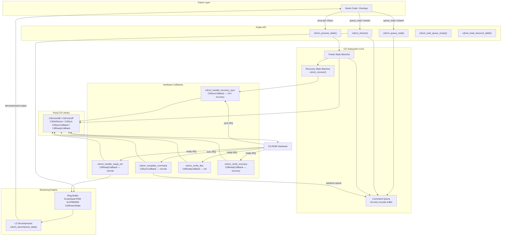
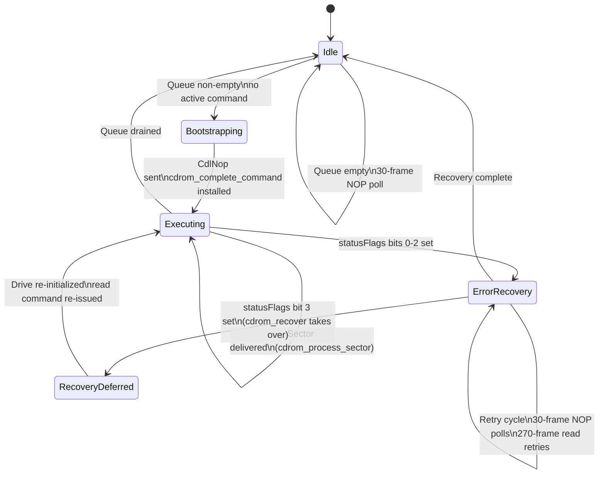
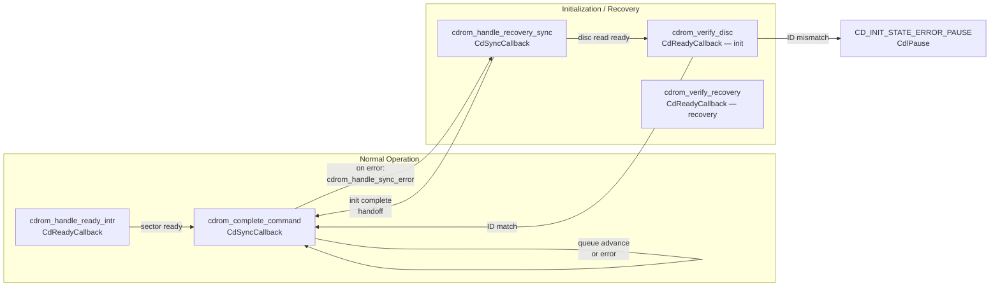
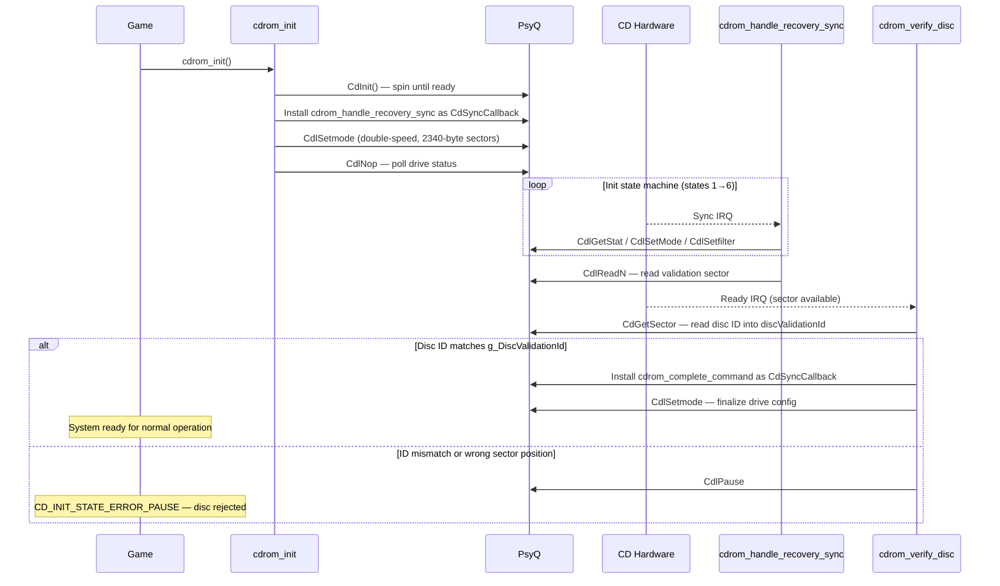
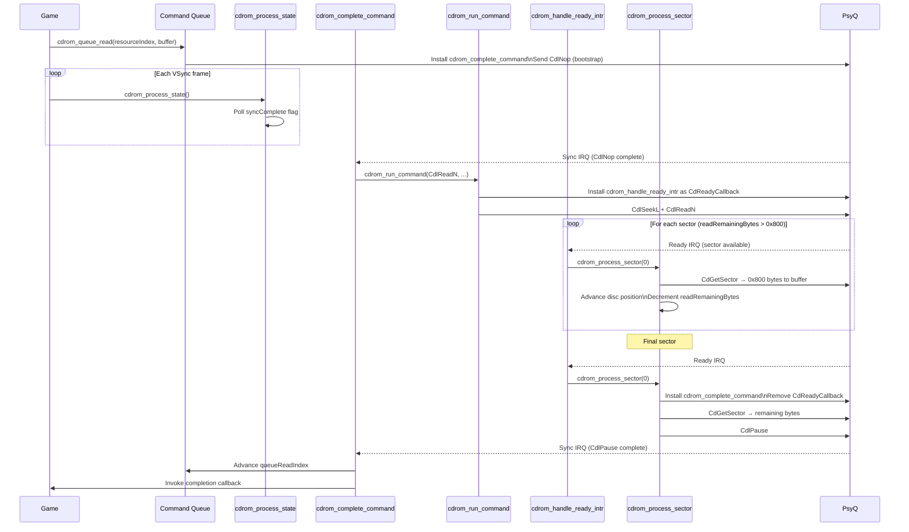
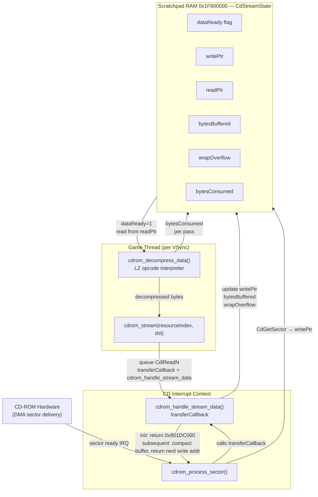

# CD-ROM Subsystem Architecture

## Overview

The CD-ROM subsystem is the central data delivery layer of the game engine. It manages all disc reads, XA audio playback, disc validation, and hardware error recovery through an asynchronous, frame-driven design.

Game code submits read commands to a 16-entry circular queue and receives data through destination buffers or callbacks. The disc drive is controlled entirely through PsyQ's interrupt callback system — the game thread never blocks on disc I/O except at explicit synchronization points. All command lifecycle management, retry logic, and error recovery runs autonomously within the frame loop.

### Design Principles

| Concern | Approach |
|---|---|
| Asynchrony | Commands queued; data delivered via DMA and callbacks |
| Frame pacing | `cdrom_process_state()` drives all progress once per VSync |
| Error tolerance | Automatic retry with multi-state hardware recovery |
| Throughput | Double-speed mode, 2340-byte sectors, streaming LZ decompression |
| Disc validation | Shift-JIS ID string verified against `g_DiscValidationId` at boot |

---

## System Architecture



---

## Central State: `CdSystem`

All subsystem state lives in a single `CdSystem` struct mapped at fixed address `0x801ED800`. Key fields:

| Field | Purpose |
|---|---|
| `statusFlags` | Bitmask: error (bit 0–2), recovery-deferred (bit 3), busy (bit 4), playing (bit 6), retry-exhausted (byte 3) |
| `commandQueue` | 16-entry circular buffer of `CdCommandQueueItem` |
| `queueReadIndex` / `queueWriteIndex` | Head and tail of the circular queue (masked with `& 0xF`) |
| `currentCommand` / `initCommand` | Active command identifiers; non-zero means the system is busy |
| `initState` | Current state within the init/recovery state machine |
| `transferCallback` | Per-sector callback installed for streaming and audio reads |
| `currentWritePtr` | Destination pointer advanced as each full sector is delivered |
| `readRemainingBytes` | Bytes left to read in the current multi-sector transfer |
| `vsyncTimestamp` | VSync counter snapshot used for timeout calculations |
| `previousSyncCallback` / `previousReadyCallback` | Saved PsyQ callbacks restored on `cdrom_restore_callbacks()` |

Scratchpad RAM at `0x1F800000` is aliased as `CdStreamState` during streaming operations (see [Streaming Architecture](#streaming-architecture)).

---

## Command Queue

Each of the 16 queue slots holds:

```
CdCommandQueueItem {
    command        — CD-ROM command byte (CdlReadN, CdlSeekL, etc.)
    resourceIndex  — Index into CD_RESOURCE_ENTRIES, or 0xFFFF for the default resource
    entry          — Resolved pointer to CdResourceEntry (disc location + data size)
    dstBuffer      — Destination RAM address for read data
    callback       — Invoked on command completion
}
```

`CdResourceEntry` records map resource indices to disc locations and byte sizes. They are loaded from disc at startup by `cdrom_load_resource_table()` into `CD_RESOURCE_ENTRIES` at `0x801ED998`.

`cdrom_queue_command()` performs deduplication (skips re-enqueue if the same command, resource, buffer, and callback are already pending) and validates that the resource has a non-zero disc location and data size before writing to the queue.

---

## Frame State Machine

`cdrom_process_state()` is called once per VSync frame and selects one of three execution branches based on `statusFlags`:



**Timeout constants (NTSC 60 Hz):**

| Timeout | Frames | Purpose |
|---|---|---|
| NOP poll | 30 | Periodic drive status check when idle or in recovery |
| Command timeout | 240 | Re-install callbacks and retry via CdlNop |
| Read retry | 270 | Re-issue CdlReadN after a stall |

---

## Callback Architecture

The subsystem maintains two distinct callback pairs and swaps between them depending on operating mode:



`cdrom_handle_sync_error()` handles unrecoverable sync failures by clearing both callbacks, setting `statusFlags` bit 0 (error), resetting all command state, and recording a fresh VSync timestamp so recovery timing begins cleanly.

---

## Initialization and Disc Validation

On startup, `cdrom_init()` performs a blocking hardware initialization, then the system drives a multi-state init protocol through `cdrom_handle_recovery_sync`:



---

## Normal Data Read



---

## Error Recovery

When the drive reports an error or the disc tray is opened, `statusFlags` bits 0–2 are set and `cdrom_recover()` takes control of the re-initialization sequence:

```mermaid
stateDiagram-v2
    [*] --> Flush: Error detected\nor shell opened

    Flush: State 0 — Flush
    Flush: CdFlush() discards pending commands
    Flush --> SetMode: 1-frame delay

    SetMode: State 1 — Set Mode
    SetMode: CdlSetmode 0xA0\n(double-speed, 2340-byte sectors)
    SetMode: Installs cdrom_handle_recovery_sync
    SetMode --> SetFilter: 4-frame delay

    SetFilter: State 2 — Set Filter
    SetFilter: CdlSetfilter (file=1, channel=1)
    SetFilter: initCommand = 0x11
    SetFilter --> Dispatch

    Dispatch: State 3 — Dispatch
    Dispatch: Waits for syncComplete\nor 30-frame timeout

    state Dispatch {
        [*] --> CheckCmd
        CheckCmd --> SendDemute: initCommand = 0x11
        CheckCmd --> RetryFilter: initCommand = 0x10
        CheckCmd --> SendPause: initCommand = 0x12
        SendDemute --> CheckCmd: CdlDemute sent
        RetryFilter --> CheckCmd: CdlSetfilter re-sent
        SendPause --> [*]: CdlPause sent\nRecovery complete
    }

    Dispatch --> Flush: 270-frame timeout\nor persistent error
    Dispatch --> [*]: Drive ready\nResume read command
```

After successful recovery, the interrupted read command is re-issued at the last known `recoveryReadPosition`. Sector headers are verified by `cdrom_verify_recovery()` before accepting data (up to 16 retries per sector).

---

## Streaming Architecture

`cdrom_stream()` and `cdrom_stream_chunked()` deliver large compressed assets using a ring buffer in scratchpad RAM and an inline LZ decompressor, allowing decompression to proceed concurrently with sector delivery.



**Ring buffer bounds:**
- Buffer base: `0x801DC000` (scratchpad start)
- Buffer end: `0x801DC118`
- On wrap: unprocessed bytes are relocated just before the end address (word-aligned), and `wrapOverflow` is merged into `bytesBuffered` on the next sector callback

**Chunked mode** (`cdrom_stream_chunked`) uses an intermediate staging buffer at `0x801DA000–0x801DBBE8`. When the staging buffer fills, the last 4096 bytes (the LZ sliding-window dictionary) are preserved at the base and decompression resumes at `0x801DB000`, maintaining back-reference validity across resets.

---

## Key Memory Map

| Address | Symbol | Contents |
|---|---|---|
| `0x801ED800` | `CD_SYSTEM` | `CdSystem` struct — all subsystem state |
| `0x801ED8F0` | `g_commandQueueOffset` | `commandQueue.items[11]` (queue base anchor) |
| `0x801ED940` | `CD_SECTOR_HEADER_BUFFER` | 3-word sector header staging area |
| `0x801ED950` | *(async mode param)* | `CdlSetmode` parameter buffer (async) |
| `0x801ED958` | `CD_COMMAND_PARAM_BUFFER` | Current `CdlLOC` for active read command |
| `0x801ED990` | `g_defaultCdResource` | Default `CdResourceEntry` (LBA + size) |
| `0x801ED998` | `CD_RESOURCE_ENTRIES` | Resource entry table loaded from disc |
| `0x1F800000` | `SCRATCHPAD` / `CD_STREAM_STATE` | Scratchpad RAM; aliased as `CdStreamState` during streaming |
| `0x801DA000` | *(staging base)* | Chunked streaming staging buffer |
| `0x801DC000` | *(ring base)* | Streaming ring buffer base |
