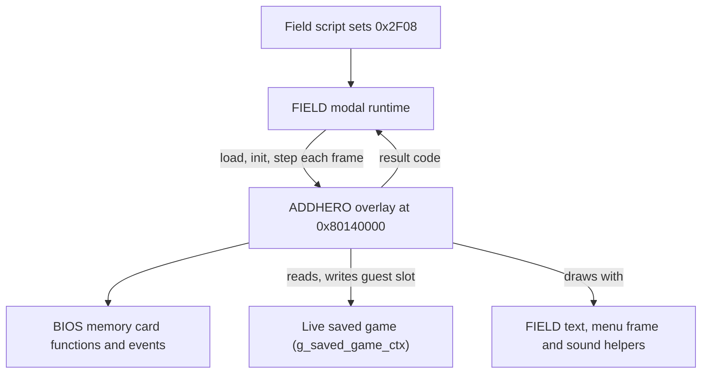
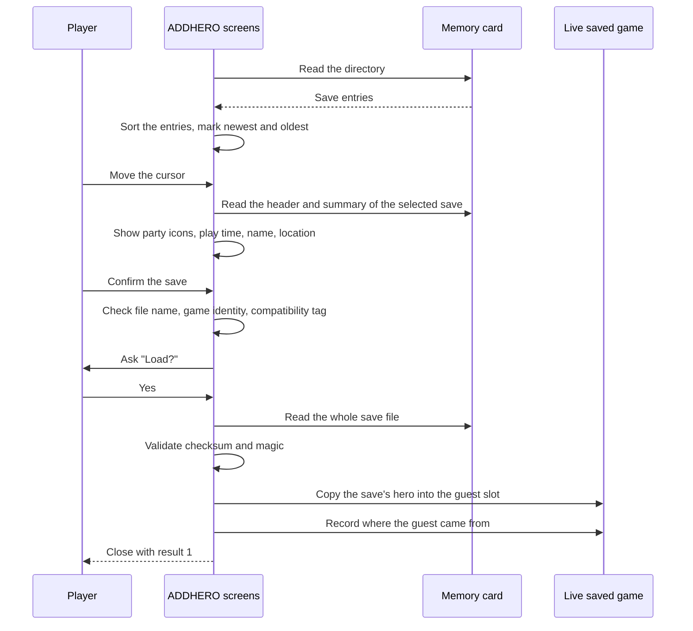
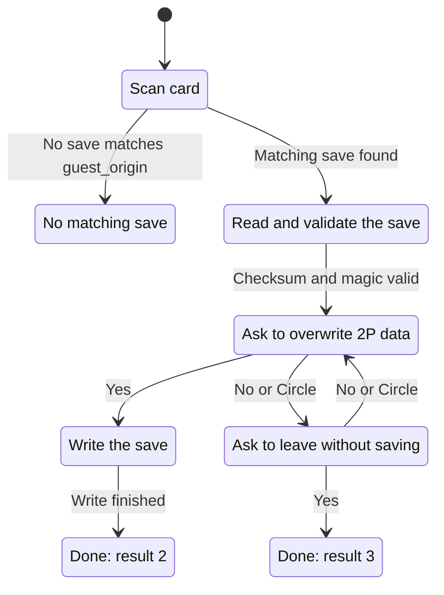

# ADDHERO overlay architecture

[English documentation](../../README.md) | [日本語](../../../jp/technical/architecture/addhero.md) | [CARDA overlay](carda.md) | [Save file reference](../reference/save-file.md)

## High-level overview

Legend of Mana lets a second player join with their own hero. The friend brings
a memory card, the game reads their hero from their save, and that hero walks
around with you as a guest. When the session is over, the guest's progress can
go back onto their card. ADDHERO is the overlay that does both of those jobs.

It's a small overlay, but it touches a lot of the game at once. It reads and
writes memory cards through the BIOS, it edits the live saved game, and it
draws its own menu screens while FIELD is still resident underneath it. If
something goes wrong here, the risk is a damaged save on someone else's card,
so most of the design is about checking before copying and never trusting a
file that doesn't validate.

ADDHERO runs in one of two modes:

| Mode | What the player sees | What it does |
|---|---|---|
| 0 | A save browser for memory card slot 1 or 2 | Loads a hero from another player's save into the guest party slot |
| 1 | A single status window | Finds the save the guest came from and writes the guest back into it |

The rest of this document covers how FIELD launches it, how each mode flows,
how card access is organized, and what is still unknown.

## Where ADDHERO fits

FIELD owns the game loop. When the game opens the 2P screen, FIELD checks
script variable `0x2F08`: `0xFF` opens mode 0 and `0x80` opens mode 1.
It then streams `ADDHERO.BIN` to `0x80140000`, the shared load address for the
modal sub-overlays (CARDA, NIKI, GOLEM and ADDHERO), and calls the overlay's
entry point.

| Component | Owns | Responsibility |
|---|---|---|
| FIELD (`field_open_addhero`, `field_update_modal`) | The modal state and the party actors | Load the overlay, step it once per frame, apply the result |
| `addhero_init` | Overlay state | Pick the mode, reset the card events, build the windows |
| `addhero_state_step` | The frame | Update and draw the windows, run the card sequence, report the exit code |
| Card sequence (`addhero_advance_load_sequence`) | The open file handle and card state | Run the load or save steps against the card |
| Guest slot (`characters[1]` in the saved game) | FIELD, after ADDHERO returns | Receive the imported hero, or be cleared after export |

ADDHERO leans on code that FIELD keeps resident: text drawing, menu frames,
scroll arrows, fades and sound effects. It doesn't carry its own copies. That
keeps the overlay small, but it also means ADDHERO only works while FIELD is
loaded.

### Lifecycle and results

FIELD calls `addhero_state_step()` every frame. It returns 0 while ADDHERO is
running. When the player finishes, ADDHERO closes its windows first, waits for
the closing animation, shuts down the card events and then returns one of three
codes:

| Result | Meaning | What FIELD does |
|---|---|---|
| 1 | A hero was loaded into the guest slot | Turns player record 1 into a hero and activates its actor |
| 2 | The guest was saved back to their card | Releases the guest's actor resources |
| 3 | Cancelled, or nothing changed | Closes the modal |

The result starts as 3, so any path that doesn't finish a load or a save ends
as a cancel.

Sources: [FIELD launcher](../../../../src/overlays/field/ui/field_modal_stream_start.c),
[FIELD modal loop](../../../../src/overlays/field/ui/field_modal_runtime.c),
[ADDHERO entry points](../../../../src/overlays/addhero/addhero.c).

## Mode 0: loading a guest hero

Mode 0 is a save browser. It scans the card in slot 1, lists every save it
finds, and shows the selected save's party, play time, hero name and location
in a details window. Select or Left/Right switches between card slots.

A few checks happen before anything is copied:

- **The file has to be a Legend of Mana save.** Its name must start with the
  game's product code prefix (`BASLUS-01013` in the US release). Other files
  are listed but can't be loaded.
- **It can't be your own game.** Every save has a random 16-bit game id that is
  created when a new game starts. If the save's game id matches the running
  game, the details window says the same hero data can't be used.
- **The compatibility tag has to agree.** Every save stores a tag byte, and so
  does the running game. A new game uses `0xFF`, which matches anything, and
  loading a save adopts that save's tag. When the two differ and neither is
  `0xFF`, ADDHERO shows its "version is wrong" message.
- **The full file has to validate.** After the whole file is read, the checksum
  and the `ANA` magic have to match. A file that fails shows the load-failed
  dialog and nothing is copied.

Only then does ADDHERO copy the save's hero (`characters[0]` in the file) into
the running game's guest slot (`characters[1]`). It keeps the guest slot's
existing control bit (bit 7 of the character info byte, set when a controller
drives the character) rather than taking the one from the file, so the guest
stays under the same control. It also stores the file's identity in `guest_origin` and sets
`guest_loaded`, which is how mode 1 finds the same file later.

The browser only reads the first 0x280 bytes of each save while you're moving
the cursor. That covers the card header and the summary at the start of the
saved game, which is enough for the details window. The full 16 KiB read happens
once, after you confirm.

## Mode 1: saving the guest back

Mode 1 has no browser. It scans the card and walks through the entries on its
own, looking for the Legend of Mana save whose identity matches the guest's
`guest_origin`. If no entry matches, it tells the player there's no load file.

Writing back replaces the hero in that file with the guest's current character
record, sets the control bit on it, recalculates the checksum and writes the
whole 16 KiB file. After a successful write ADDHERO clears the guest's name,
which removes them from the party, and FIELD releases the guest's actor.

If the player chooses not to save, ADDHERO closes with result 3 and leaves the
guest slot alone.

### How a save is written

ADDHERO doesn't write over the original file directly. It creates a temporary
file first, named with the product code and `DUMMY` (`BASLUS-01013DUMMY` in the
US release), writes the new data into it, and then renames it over the
original.

The order of the erase depends on free space:

| Card has room for another 2-block file | Steps |
|---|---|
| Yes | Create the temporary file, write it, erase the original, rename the temporary file |
| No | Erase the original, create the temporary file, write it, rename it |

The first path keeps the old save on the card until the new one has been
written. The second path doesn't have that luxury. If the write fails after the
original was erased, the player's save is gone. This is original game behavior,
and it's worth knowing before changing anything in this area.

Sources: [load and save screens](../../../../src/overlays/addhero/addhero_widgets.c),
[card sequence](../../../../src/overlays/addhero/addhero_card.c).

## Working with the memory card

All card access goes through one small step machine. Each list of steps is a
byte sequence (`g_addhero_loadseq_*`), and `addhero_advance_load_sequence()`
runs the current step each frame. A step either finishes and moves on, waits for
a card event, or reports a result that sends the machine to another sequence.

| Step group | Examples |
|---|---|
| Card status | Issue `_card_info`, clear or wait for card events |
| Directory scan | Erase leftover temporary files, read the directory, sort the entries |
| Card reset | `_card_clear` and `_card_load`, with retries |
| Reading | Open a save, start an asynchronous read, wait for it |
| Writing | Create the temporary file, write, rename over the original |

The BIOS reports card activity through eight events: I/O done, error, timeout
and new card, each for the software (file I/O) and hardware (slot) side.
ADDHERO opens them once at startup and polls them; it doesn't use interrupts.

Retries are counted per operation:

| Operation | Attempts |
|---|---|
| File erase and rename calls, directory scan steps | 20 |
| Save read or write | 5 |
| `_card_load` after an error, and after a new card was inserted | 16 each |

When those run out, the error ends up either as a dialog (load failed, save
failed) or as an entry state. For an entry state, the list or status window
shows a message such as no memory card, access failed or not enough free blocks
instead of the entries.

The progress bar on the loading and saving screens fills over 256 frames,
counted from the moment the read or write starts. It's a timer, not a measure of
how much data has been transferred.

The browser also blocks input while the card is being scanned, while a file
operation is in flight and while the step machine sits on the scan steps. That's
what keeps the player from switching cards in the middle of a read.

## Screens and text

ADDHERO draws everything through a pool of eight animated windows. Each window
grows open over about 8 frames, stays active while it draws its contents, then
shrinks closed over about 8 frames. Slot 0 of the pool is reserved for dialogs and the load progress
window, and it's drawn with the brighter frame.

| Window | Mode | Contents |
|---|---|---|
| Title | 0 | Heading for the browser |
| Card slot labels | 0 and 1 | Slot 1 and 2 labels; the inactive slot is dimmed |
| Entry list | 0 | Save list with serial, newest and oldest markers, scroll arrows |
| Details | 0 | Party icons, play time, hero name, location or a warning |
| Load prompt | 0 | The Load? question, then the loading progress bar |
| Status | 1 | Card messages, the overwrite prompt and the progress bar |
| Dialog | 0 and 1 | Load failed, save failed, card not inserted |

The text comes from ADDHERO's own string table, except the time separator and
the Yes and No choices, which come from FIELD's UI table. Save titles read from
the card header are Shift-JIS, so the overlay draws them with the BIOS Kanji ROM
and caches the glyphs in VRAM. See [text tables](../reference/text-tables.md)
for how the string tables are stored.

## Regional differences

The US and JP builds share the same design. The visible differences are layout
and defaults:

- JP uses its own product code in file names (`BISLPS-02170`).
- JP narrows the card slot labels and moves the entry list columns.
- The Yes/No prompt defaults to No in the US build and Yes in JP.
- The JP details window is still assembly in this project, so its behavior
  hasn't been compared line by line with the US C code.

## Open questions

These are the parts we don't understand yet. They don't block using the
overlay, but they matter if you want to change how it behaves.

- **Tags other than `0xFF`.** The game starts up with a compatibility tag of
  7, in both releases, but a new game or a loaded save replaces it. We haven't
  found what produces a save with any tag other than `0xFF`, which is the only
  case where the version check can refuse one.
- **A write-only FIELD word.** ADDHERO stores 3 at `0x80122718` when the
  browser is cancelled with Circle. Nothing in the main executable or any
  overlay reads that address.
- **The rank count.** The entry list starts its rank count at 40 and uses it to
  pick the newest and oldest markers. We know what the markers mean, but not
  why the starting value is 40.

## Source map

| Source | Architectural role |
|---|---|
| [addhero.c](../../../../src/overlays/addhero/addhero.c) | Entry points, browser input, entry list, details window, window animation |
| [addhero_widgets.c](../../../../src/overlays/addhero/addhero_widgets.c) | Load prompt, progress screens, dialogs, mode 1 status window, save validation |
| [addhero_card.c](../../../../src/overlays/addhero/addhero_card.c) | Card step machine, directory scan, entry sorting and ranking, card events |
| [addhero_glyph.c](../../../../src/overlays/addhero/addhero_glyph.c) | Shift-JIS glyph cache for card titles |
| [addhero_internal.h](../../../../src/overlays/addhero/internal/addhero_internal.h) | Window layout, entry states, text indexes, shared declarations |
| [saved_game.h](../../../../include/common/saved_game.h) | Save file and saved game layout |
| [field_modal_stream_start.c](../../../../src/overlays/field/ui/field_modal_stream_start.c) | Loading and starting the overlay |
| [field_modal_runtime.c](../../../../src/overlays/field/ui/field_modal_runtime.c) | Per-frame stepping and result handling |
