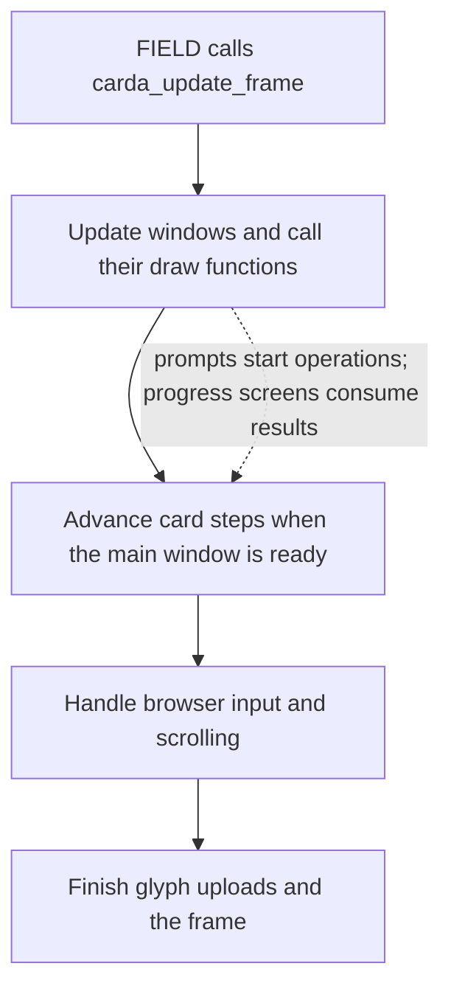
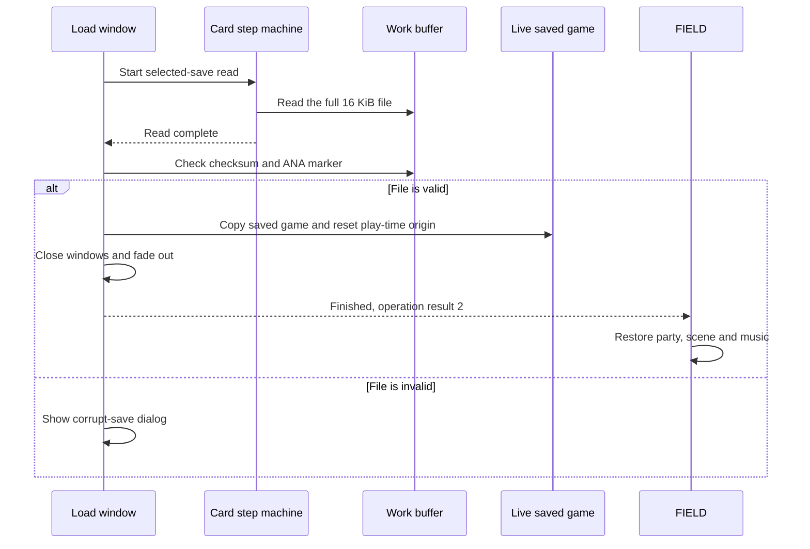
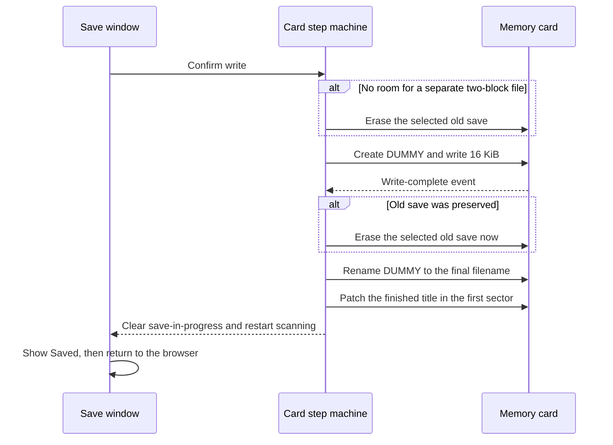

# CARDA: saving, loading and PocketStation transfers

[English documentation](../../README.md) | [Japanese](../../../jp/technical/architecture/carda.md) | [Save file reference](../reference/save-file.md)

When you choose a save file, the game has already done quite a bit of work. It
has checked the card, read its directory, sorted the entries and loaded enough
of the selected file to show the details window. CARDA owns that screen and the
card operations behind it. It also handles sending pets to Ring Ring Land and
bringing them back.

There are four modes:

| Mode | Job | Screen |
|---|---|---|
| 0 | Save the current game | File browser, new-save and overwrite prompts |
| 1 | Load a saved game | File browser and load prompt |
| 2 | Send a pet to Ring Ring Land | Slot selection and download or pet-swap prompts |
| 3 | Return a pet and its items | Slot selection, return prompt and received-item list |

The useful thing to understand here is where each operation changes something.
Reading a preview is different from replacing the live saved game. Writing a
file is different from deciding that the screen can close. Those decisions are
spread across the card step machine and the window callbacks, so we'll follow
them together. The [save-file reference](../reference/save-file.md) covers the
bytes inside an ordinary save.

## FIELD owns the session

`field_open_carda(mode)` loads `CARDA.BIN` at `0x80140000` when no other modal
is running, then calls `carda_init()` with a work buffer at `0x80170000`. If a
modal is already active, the function returns without opening anything; it
doesn't queue the request. FIELD stays resident
and continues calling `carda_update_frame()` with the current render buffer.

| Owner | What it keeps | What CARDA does with it |
|---|---|---|
| FIELD | Modal state, render buffers, scene and script results | Draw into the current frame and report how the card screen ended |
| Live saved game (`g_saved_game_ctx`) | The game currently being played | Build a save from it, replace it after a valid load, or update pets and items |
| CARDA work buffer (`g_carda_save_blob`) | A complete ordinary save or a PocketStation transfer file | Prepare outgoing data and receive incoming data |
| CARDA browser and windows | Directory entries, selected-file preview, selection and prompts | Show the card and decide which operation to start |
| Card step machine (`g_card_step`) | Current operation, file handle and retry state | Issue card commands and consume their results |

Initialization opens the card events, resets the browser, clears the UI's VRAM
area and builds the windows. The work buffer is aligned to four bytes.
CARDA uses FIELD's text, menu-frame, fade and sound helpers throughout the
session.

There are two separate ways to report completion. `carda_update_frame()` returns
0 while running and 1 when the screen has finished. The operation result lives
in `g_field_card_overlay_mode`, which FIELD initially sets to `mode + 1`.
A completed load leaves 2 there; cancelling the ordinary browser sets 3.
Pet transfers set 4 for sent, 5 for returned, and 6 or 7 for cancellation of
those respective modes. A full ranch also takes the return-cancelled path.

Saving doesn't immediately leave CARDA. It shows "Saved.", refreshes the card,
and returns to the browser when that message is dismissed. Leaving the browser
later uses the cancellation result even if a save was written during the
session. The result describes how the modal ends; it isn't a record of every
operation performed in it.

Once the main window is free, CARDA requests exit. On the next frame it shuts
down the card events, resets FIELD's text windows and waits for GPU work to
finish. FIELD then releases the modal. For a completed load, FIELD also rebuilds
the party and restores the scene and music from the newly loaded game.

Sources: [FIELD launcher](../../../../src/overlays/field/ui/field_modal_stream_start.c),
[FIELD modal loop](../../../../src/overlays/field/ui/field_modal_runtime.c),
[CARDA entry points](../../../../src/overlays/carda/carda.c).

## The windows and card operations advance together

CARDA has two cooperating state machines. One opens, draws and closes the
windows. The other walks byte tables of card operations through `g_card_step`.
A table can check the card, scan its directory, read a file, write a replacement,
or reset the card after a change.



A draw function can do more than emit GPU packets. The load prompt starts a
read. The loading window validates the completed file and copies it into the
live game. The PocketStation window handles most of the transfer flow. If
you're following an operation in the source, you need its window callback as
well as `carda_advance_card_sequence()`.

A card step can ask to run again immediately, wait for an event, or finish.
`carda_update_card_sequence()` keeps going in the same frame while the result
is `CARDA_SEQUENCE_RUN_AGAIN`. This is driven by the game loop, but some steps
also call `_card_wait()` or poll in a loop, so it isn't entirely nonblocking.

The BIOS exposes completion, error, timeout and new-card events on both the
software and hardware sides. CARDA opens all eight with `EvMdNOINTR` and polls
them. Failures can restart scanning, select another step table, or replace the
active prompt with an error dialog. Writes use a retry counter initialized to
5; many synchronous file operations allow 20 attempts. Reads have their own
failure paths, so the write retry count doesn't apply to every operation.

Browser input is held while a prompt is active, a directory scan or preview
read is in progress, or the main window is closing. Window transitions also
clear the pad input. This prevents a card switch from being treated as ordinary
navigation while an operation is using the current selection.

The progress bar uses elapsed `VSync` ticks. Ordinary reads and writes reach
full width after 256 ticks; PocketStation transfers scale that timer according
to the operation. Completion comes from the card state, independently of how
full the bar looks.

Sources: [window updates, prompts and progress](../../../../src/overlays/carda/carda.c),
[card steps and events](../../../../src/overlays/carda/carda_card.c).

## Loading a saved game

The browser clears leftover temporary files and reads the card directory. It
sorts entries by type and filename suffix, uses the save serials to rank them,
and initially selects the newest recognized save. Save mode can also append a
synthetic "New Save" entry when there's room.

Moving the cursor reads a preview into `g_carda_selected_file`. A recognized
Legend of Mana save gets a `0x280`-byte read, enough for its card header and game
summary. Other files get the first `0x80` bytes for their title. Neither read
replaces the running game.

For a load, CARDA checks the filename prefix and compatibility tag before
opening the confirmation. The current tag must be `0xFF`, which accepts any
file tag, or equal the selected save's tag. After the player confirms:



The copy happens in `carda_draw_load_progress()`, after both checks pass.
An I/O failure goes to the load-failed dialog; an invalid checksum or marker
goes to the corrupt-save dialog. Neither path copies the incoming game into
`g_saved_game_ctx`.

Sources: [browser selection and load validation](../../../../src/overlays/carda/carda.c),
[directory and preview reads](../../../../src/overlays/carda/carda_card.c).

## Writing a save

`carda_build_save_file()` prepares the work buffer when the ordinary save,
overwrite or load confirmation opens. It updates the live play-time counter
and file-select summary, copies the saved game, assigns the copy a new save id
and load-entry spawn value, and builds the title, icon, checksum and `ANA`
marker. Cancelling the prompt doesn't undo those live counter and summary
updates, but no card file has been written at that point.

The checksum is calculated with the finished title. The builder then replaces
the beginning of that title with the temporary `MANA-BAD.` text. The file only
gets its finished title after the main write and rename steps.

For an overwrite, the free space decides when the old file is erased:



With two spare blocks, CARDA can keep the old save until the replacement's
main write completes. Without them, it has to erase the old save first. Even
with spare space, the erase, rename and title patch are separate operations.
The source doesn't provide an atomic replacement or a rollback of the old
file. That's why the exact ordering matters here.

The final name includes the next serial, the option marker and the displayed
save number. The title patch makes the header agree with the checksum already
stored in the file. The [save-file reference](../reference/save-file.md) explains
those fields and how an interrupted write appears on the card.

An unformatted card follows another prompt. Save and send-pet modes can offer
to format it; load and return-pet modes report that state instead. Confirming
formatting leads into creating a save or transfer file, so it is part of the
write flow, not just a return to an empty browser.

Sources: [save builder and prompts](../../../../src/overlays/carda/carda.c),
[write, rename and title patch](../../../../src/overlays/carda/carda_card.c).

## Sending and returning pets

PocketStation modes start with slot selection and check the device through
`McxCardType()`. Ring Ring Land occupies six blocks (`0xC000` bytes), compared
with two blocks for an ordinary game save. Returning a pet only needs the
first `0x400` bytes of that transfer file.

For a new download, CARDA loads the transfer resource from CD and passes it,
along with the selected ranch pet, to the regional preparation hook. After the
card write completes, it clears the pet's name in the live ranch record, which
marks that slot empty, and sets result 4.

If Ring Ring Land already has a pet, sending another one becomes a swap. CARDA
reads the existing pet and refuses the operation if its unique id already
belongs to a pet on the ranch. On confirmation it keeps a copy of the incoming
pet and adds its received items, then prepares and writes the outgoing pet.
After the write completes, it restores the incoming pet into the outgoing
pet's ranch slot and applies its growth. The item additions happen before the
outgoing write; the pet-slot replacement happens afterward.

Returning a pet without sending another follows this order:

1. Confirm that Ring Ring Land will be erased, then read its transfer prefix.
2. Reject a pet whose unique id is already on the ranch, and find an empty slot.
   If there isn't one, finish with result 7.
3. Add the received items, restore the pet into that slot, apply its experience
   delta and run FIELD's level-up helper.
4. Request deletion of the Ring Ring Land file and set up the result for FIELD.
   The live pet and items have already changed before this erase call.
5. Show the items that were actually added, or finish immediately if there are
   none. The successful return uses result 5.

Items already at 99 are skipped. The received-item window lists successful
additions; it doesn't postpone applying them until the player dismisses it.
These changes affect the running game. The transfer flow doesn't also write
an ordinary two-block game save.

Sources: [transfer flow and item handling](../../../../src/overlays/carda/carda.c),
[transfer I/O](../../../../src/overlays/carda/carda_card.c).

## Looking at the data

The overlay's data after the code is kept in one `carda_data` blob in each
version's splat YAML. The build links those bytes unchanged. To read the text
and see the icons, extract that version with `make splat` first, then run:

```sh
make extract-carda
make extract-carda VERSION=jp
```

The files go under `assets/exports/<version>/overlays/carda/`. Messages, item
names, locations, title templates and card steps become YAML. Party icons
become 48 x 48 PNGs. The ten memory card icons go in `save_icons/`, with two
16 x 16 PNGs per icon for their animation frames. Japanese text uses the
overlay's character chart; the original text bytes are kept beside it.

`byte-map.yaml` accounts for the whole blob, including padding and the zeroed
runtime buffers. These exports are for inspection; the build still uses the
original blob. See the [extractor guide](../../../../tools/data/overlays/README.md)
for output options and the Python layout.

## Regional coverage and what still needs work

The shared C explains the ordinary card I/O and the transfer flow for both
releases. The pet-copy, item-addition and deletion order described above is the
same in the JP transfer window (`carda_draw_save_flow`).

`card_prepare_pet_transfer` fills the transfer resource. In JP it copies the
pet record, clears the reward list, and records which lands are placed and
which have fully raised mana. In US the function is empty. The retained US
transfer branches therefore don't establish a working US Ring Ring Land
feature. Its PocketStation messages are also left empty.

The shared Yes/No initializer selects No in US and Yes in JP. Some transfer
prompts set their choice directly, so that isn't a rule for every prompt.
JP also has different text spacing and browser layout.

The remaining work is mostly inside the transfer payload: the full meaning of
the additional data prepared by the JP hook, and the minigame's own use of it.
This guide covers CARDA's side of the exchange. The ordinary save's unresolved
tags and option meanings remain in the
[save-file reference](../reference/save-file.md#what-we-dont-know-yet).

Sources: [regional preparation hook](../../../../src/main/card_callbacks.c),
[regional CARDA branches, transfer window and prompt defaults](../../../../src/overlays/carda/carda.c).

For the UI types and state names, start with
[carda_internal.h](../../../../src/overlays/carda/internal/carda_internal.h).
[carda_glyph.c](../../../../src/overlays/carda/carda_glyph.c) supplies the shared
glyph-cache routines used for card titles; their encoding is covered by
[text tables](../reference/text-tables.md#memory-card-titles-are-different).
[ADDHERO](addhero.md) uses a related browser for importing and returning a guest
hero, with different rules for which parts of a save it changes.
