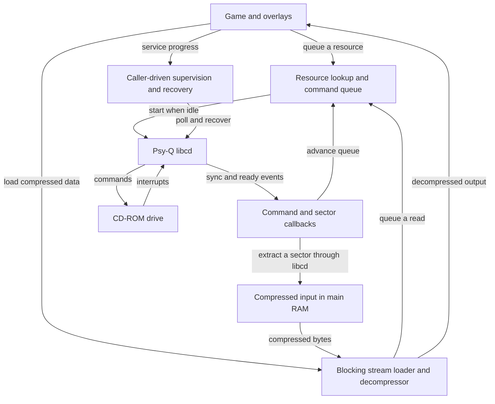
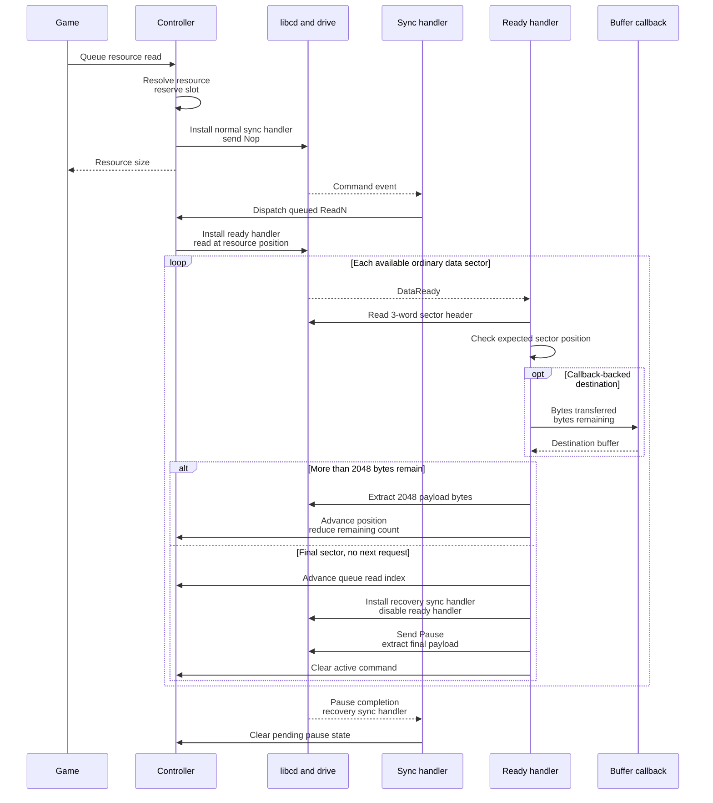
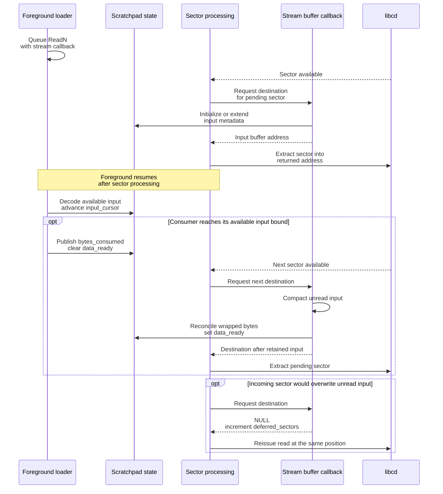
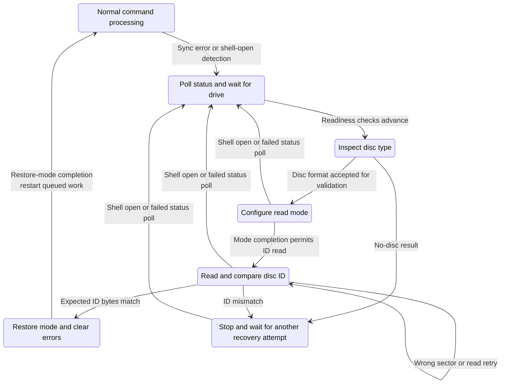
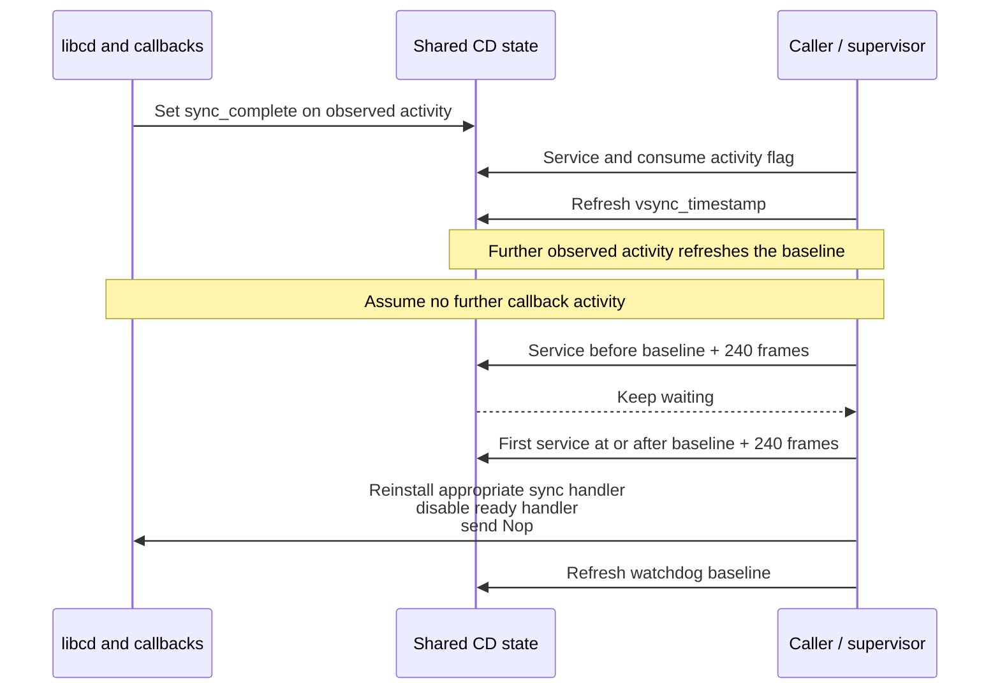

# CD-ROM subsystem architecture

[English documentation](../../README.md)

## High-level Overview

The main CD-ROM subsystem turns resource requests into a serialized stream of
reads from one physical drive. It serves overlay loading, asset loading, and the
CD side of movie/XA playback. Callers identify a resource by index; a resident
resource table supplies its disc position and byte length.

The design combines an asynchronous command queue, interrupt callbacks, and
caller-driven supervision. Interrupt callbacks move sectors and advance
commands. `cdrom_process_state()` observes progress, checks the drive, and runs
automatic error recovery when callers service it. Blocking loading routines
build on that same machinery and decompress data while sectors arrive.

Three properties matter at the architectural level:

- **One owner of the drive.** One global controller, one active transfer, and
  one pair of libcd callback slots serialize access. There are 16 queue slots,
  with room for 15 outstanding entries because one slot distinguishes full
  from empty.
- **Fixed memory use.** Compressed input uses an 8 KiB region in main RAM.
  Streaming metadata lives separately in scratchpad RAM. Chunked output uses
  another fixed staging area and preserves 4096 bytes of decompression history.
- **Progress depends on both interrupts and servicing.** Queue submission is
  asynchronous, but initialization, sector extraction, recovery operations,
  and synchronous loading can wait. Frame-based watchdogs support recovery;
  they do not guarantee a maximum loading time.

This is an implementation description of [the main CD module](../../../../src/cdrom.c)
and [its decompressor](../../../../src/cdrom_decompress.c). The separate CD implementation
inside CHECKPS is covered by the [CHECKPS guide](checkps.md). The architecture and known
limitations below describe the matching code, including behavior retained from
the original executable.

## Components and ownership

The input-buffer branch shows compressed loading. Ordinary reads transfer into
the caller's destination. Movie/XA reads use a specialized transfer callback.

| Component | Responsibility | State it depends on |
|---|---|---|
| Resource table and queue | Resolve indices, admit requests, retain their order | `CdResourceEntry`, `CdCommandQueueItem`, queue indices |
| Controller | Track the active command, transfer position, status, and recovery phase | `CdSystem` |
| libcd callbacks | React to command completion and sector availability | Active callback slots and `CdSystem` |
| Supervisor | Detect missing progress, poll status, validate the disc after errors | VSync timestamps, status flags, recovery state |
| Stream loader | Consume compressed input, release consumed space, produce output | Scratchpad `CdStreamState`, main-RAM buffers |
| Movie integration | Coordinate sector delivery with MDEC, GPU, and audio activity | `MovieState`, transfer callback, deferred-ready flag |

### Execution context

There is no worker thread in this module. Foreground game code and interrupt
callbacks share state on the same CPU. Disc activity can continue while the
foreground runs, and callbacks can interrupt decompression.

| Work | Where it runs |
|---|---|
| Queue submission and `cdrom_process_state()` | The calling game or overlay code |
| Normal sync/ready handlers | libcd callback context |
| `CdCommandCallback` | Inside sector processing, normally the ready callback; also the deferred-service path |
| Decompression, `get_buffer`, and `chunk_done` | Inside the synchronous stream-loading call |
| `cdrom_verify_recovery()` | Its caller's context; the movie MDEC-output callback is one concrete caller |

`cdrom_verify_recovery()` is a deferred-sector service routine. It is not
installed as a libcd ready callback. The name alone does not describe its
execution context.

The controller uses handshake flags such as `sync_complete` and
`data_ready_pending`; the stream uses `data_ready` and `input_complete`.
Some fields are volatile because callbacks update them. These are local
coordination mechanisms, not a general thread-safety or reentrancy contract.
Nested stream loads would share the same metadata and buffers.

Sources: [CD controller](../../../../src/cdrom.c),
[stream state](../../../../src/cdrom_internal.h), and
[movie deferred-sector integration](../../../../src/overlays/movie/movie_stream.c).

## Public contract and request lifecycle

### Entry points

| API | Caller-visible behavior |
|---|---|
| `cdrom_init()` | Blocks while initializing the drive, clears subsystem state, and selects double-speed, 2340-byte sector mode |
| `cdrom_queue_read()` | Queues an ordinary resource read into caller-owned memory |
| `cdrom_queue_read_with_callback()` | Queues a read whose callback supplies each sector destination |
| `cdrom_queue_seek()` | Queues a seek; dispatch may discard it if another queued command supersedes it |
| `cdrom_process_state()` | Services progress and recovery; returns the pending count, except that explicit reconfiguration returns zero immediately |
| `cdrom_wait_queue_empty()` | Repeatedly services the controller and waits on VSync while that return value is nonzero |
| `cdrom_stream()` | Drains earlier queued work, then blocks while reading and decompressing one resource; returns decompressed byte count |
| `cdrom_stream_chunked()` | Blocks while obtaining output buffers and reporting completed chunks; shares the global streaming resources |
| `cdrom_get_error_status()` | Reports a prioritized subsystem error state, separate from queue admission results |
| `cdrom_stop()` / `cdrom_reset()` | Pause activity and clear state; reset also restores movie-related callbacks and handles CD audio |

A successful queue call returns the resource's byte size, not a request handle
or a completion result. Admission errors are `-1` for a full queue, `-2` for an
entry with zero location or size, and `-3` for a locked queue. The module does
not validate a resource index against a table-length field.

Resource `0xFFFF` selects `default_cd_resource`. This lets
`cdrom_load_resource_table()` bootstrap the table itself: set a location from
the supplied LBA, queue the read into `CD_RESOURCE_ENTRIES`, then wait for it.
Normal callers subsequently use indexed table entries rather than path lookup.
See [disc layout](../reference/disc-layout.md) for the table and on-disc resource organization.

### Admission and completion are different events

The queue suppresses a consecutive duplicate while the controller is busy if
command, resource, destination, and callback all match the last submission.
It does not search the whole queue for duplicates. The active request remains
at the read index until its transfer or command-specific completion logic
advances that index.

`CdCommandCallback(bytes_transferred, bytes_remaining)` runs **before** the
pending ordinary sector is copied. `bytes_remaining` includes that sector.
Its return value selects the destination; returning `NULL` requests a retry
of the current sector. This is not a command-completion callback.

For movie/XA transfers, the callback handles the specialized sector path and
`NULL` means end the transfer. The generic data path's byte accounting and
buffer-return contract must not be applied to that mode unchanged.

Sources: [public types and API](../../../../include/cdrom.h), `cdrom_queue_command()`,
`cdrom_run_command()`, and `cdrom_process_sector()` in
[the controller](../../../../src/cdrom.c).

### Ordinary read sequence

This sequence shows an idle controller, an accepted read, no errors, and an
empty queue after its final sector. It omits repeated supervisor calls to keep
the transfer order visible.

Normal reads issue `ReadN` with the target location; there is no mandatory
separate `SeekL` command before every read. Header validation compares the
low 24 bits of the sector position before accepting the payload.

A full ordinary payload is 2048 bytes, despite the drive's 2340-byte sector
mode. The final extraction rounds the remaining byte count up to 32-bit words.
Destination storage must accommodate that rounding.

If another request is queued, the final-sector path can dispatch it directly.
`CdExecutionMode` preserves the ordering between starting that next command
and extracting the previous request's final payload:

| Mode | Ordering |
|---|---|
| `CD_EXECUTION_MODE_ASYNC` | Start the command and install the normal read callback when needed |
| `CD_EXECUTION_MODE_COMMAND_THEN_READ` | Issue the next command before extracting the previous final payload |
| `CD_EXECUTION_MODE_READ_THEN_COMMAND` | Extract the previous final payload before issuing the next command |

Deferred sector service uses the read-first ordering. With no next request,
it likewise sends Pause after extracting the final payload. Queue retirement,
last-byte delivery, and drive pause completion are therefore distinct events.
There is no public per-request completion callback in this API.

## Streaming and decompression

Streaming uses a producer/consumer handoff. Sector processing produces
compressed bytes; the foreground loader consumes them. `CdStreamState` is
metadata in scratchpad RAM. The compressed bytes themselves are in main RAM.

### Memory and ownership

| Location | Use | Important boundary |
|---|---|---|
| `0x1F800000` | Scratchpad `CdStreamState` during streaming | Shared with other scratchpad uses; not the compressed-data buffer |
| `0x801DC000` to `0x801DE000` exclusive | 8192-byte compressed-input region | First payload starts at `0x801DC001`, skipping one header byte |
| `0x801DC118` | Wrapped-input restart/compaction anchor | 280 bytes above input base; not the buffer end |
| `0x801DA000` | Chunked-output staging base | Retains the last 4096 output bytes when recycling staging |
| `0x801DBBE8` | Staging decoder stop threshold | Checked between opcode expansions, not a strict last-write address |
| Caller-supplied destination | Final decompressed output | Caller supplies sufficient storage and preserves its lifetime |

The metadata fields describe the handoff:

| Field | Meaning |
|---|---|
| `buffer_start` | Start of the current contiguous compressed-input span |
| `input_cursor` | Decoder's current position within that input |
| `bytes_buffered` | Bytes represented by the current span |
| `bytes_consumed` | Consumption published by the loader when releasing the span |
| `wrap_overflow` | Bytes received in the wrapped portion, pending reconciliation |
| `data_ready` | Published input is available; clearing it releases consumed space for compaction |
| `input_complete` | Final-input indication set on the callback's append path |
| `deferred_sectors` | Count of incoming sectors refused for lack of safe buffer space |

`input_cursor` is an input pointer. The producer's next write address is
calculated by `cdrom_handle_stream_data()` and returned to sector processing;
it is not stored in a field named `write_ptr`.

### Producer/consumer sequence

The callback updates metadata before sector extraction. Correct use relies on
this execution order and the target's callback/DMA behavior; `data_ready` by
itself is not a portable cross-thread publication barrier.

While more compressed input is expected, the loader leaves a 280-byte guard
at the input boundary. When input wraps, unread bytes are copied into a
contiguous region before `CD_STREAM_WRAP_START`, with alignment padding for
word copies. The callback performs this compaction on the next handoff, or the
loader reconciles the final buffered input itself when no further sector will
do so. Buffer pressure causes a sector retry rather than overwriting unread
compressed data.

### Decoder and output modes

`cdrom_decompress_data()` interprets a custom bytecode containing literals,
repeated patterns, arithmetic runs, and backward copies. Its longest encoded
back-reference reaches 4096 bytes into earlier output. This explains why
chunked decoding must retain output history even after delivering a chunk.

The decoder updates both cursors and returns:

- `FALSE` after consuming the `0xFF` end marker;
- `TRUE` when an input or output boundary stops the next opcode expansion.

Bounds are checked between complete opcodes. One expansion may cross a stop
threshold, so guard space and buffer sizing are part of the caller contract.
This decoder is built for the game's resource format; it is not a validating
parser with a defined malformed-input error result.

`cdrom_stream()` decodes directly into caller memory and returns the number of
output bytes at the end marker. It has no destination-capacity argument.
Decompression completion does not itself assert that the drive has completed
its final pause; many callers follow it with `cdrom_wait_queue_empty()`.

With a finite chunk capacity, `cdrom_stream_chunked()` decodes into staging,
copies output across buffers supplied by `get_buffer()`, and calls
`chunk_done()` for completed chunks and the final chunk. Recycling staging
copies the last 4096 output bytes back to its base before decoding continues.
These output callbacks run in the loading call, unlike `CdCommandCallback`.

An initial capacity of `-1` selects direct output. That branch currently
ignores the decoder's end-marker return value. It must not be documented as
having the same completion behavior as finite-capacity chunking. No caller of
`cdrom_stream_chunked()` was found in the inspected C sources; its wider runtime
use is unconfirmed.

Sources: [stream-loading loops](../../../../src/cdrom.c),
[buffer callback and decoder](../../../../src/cdrom_decompress.c), and
[shared metadata](../../../../src/cdrom_internal.h).

## Initialization, recovery, and callback ownership

### Startup is a blocking configuration path

`cdrom_init()` retries `CdInit()`, saves and clears existing libcd callbacks,
resets the controller and queue, checks status with `CdlNop`, waits for the
drive if the shell-open status is present, and applies
`CdlModeSpeed | CdlModeSize1` through `CdControlB()`.

It does not install the asynchronous disc-validation callback or compare the
disc ID. The main startup sequence then loads the resource table and begins
resource loading. Disc-ID validation in this module belongs to automatic
recovery. See [main startup](../../../../src/main.c).

### Callback roles change with the active operation

libcd exposes one sync slot and one ready slot. The controller replaces or
clears them as operations change; all of the handlers below are not active
simultaneously.

| Situation | Sync handler | Ready handler |
|---|---|---|
| Normal command dispatch and data reads | `cdrom_complete_command` | `cdrom_handle_ready_intr` for reads |
| Final pause or mode restoration | `cdrom_handle_recovery_sync` | Cleared |
| Recovery disc-ID read | `cdrom_handle_recovery_sync`, or cleared after its command event | `cdrom_verify_disc` |
| Explicit reconfiguration | `cdrom_handle_recovery_sync` while a step is outstanding | Cleared |
| Sync error reset | Cleared | Cleared |

`cdrom_restore_callbacks()` reinstates the callbacks saved at initialization,
pauses the drive, and clears the controller. Movie reset also restores saved
MDEC/GPU callbacks. Ownership therefore extends beyond the CD queue during
movie playback.
The [MOVIE architecture](movie.md) describes the decoder,
audio pipeline, and presentation ownership in detail.

### Automatic recovery after drive errors

`cdrom_handle_sync_error()` clears the callbacks, records `CD_STATUS_SYNC_ERROR`,
resets command/retry state, and starts a fresh timestamp. Subsequent calls to
`cdrom_process_state()` drive status checks, disc readiness checks, disc-type
inspection, mode setup, and the validation-sector read.

The following groups several implementation states into architectural phases.
Individual retries and callback substitutions are described in the timing and
callback tables rather than shown as separate states.

Validation reads a three-word header and a 32-byte ID buffer. It checks sector
position against `recovery_read_position`, then compares the expected string
from `g_disc_validation_id`, including the supported multibyte lead-byte
ranges. A wrong sector triggers Pause and retry. An ID mismatch sets the
error/stop phase and removes the ready callback; it does not immediately
follow the successful reconfiguration path.

On a match, `cdrom_verify_disc()` requests mode restoration. Its sync completion
clears the recovery error flags and bootstraps remaining queued work. The normal
read path retains or reinitializes transfer state according to
`playback_state`, the buffer, and the callback. It continues validating incoming
positions against `current_location`; the ID-read position and active-transfer
position are separate fields.

### Explicit reconfiguration is a separate protocol

`cdrom_enter_recovery_mode()` only accepts entry while idle, with an empty queue
and no recovery errors. It sets `CD_STATUS_RECOVERY_PENDING`.
`cdrom_process_state()` returns zero immediately while that bit is set; it does
not call `cdrom_recover()` on the caller's behalf.

A caller must instead service `cdrom_recover()`. Its stages are Flush, Setmode,
Setfilter, then completion of Demute and Pause through
`cdrom_handle_recovery_sync()`. Completion clears the pending bit.

These routines share `init_state` and `init_command` with automatic recovery,
but interpret different state/command families. JP's CHECKPS startup is a
confirmed caller: it enters recovery mode, runs its own register-level CD
check, then services `cdrom_recover()` before leaving. That caller is still
assembly, which is why a search of the C sources doesn't find it. The US
CHECKPS startup uses a timed display and doesn't perform that handoff. See
[CHECKPS](checkps.md#jp-takes-control-of-the-drive-then-gives-it-back) for the
regional flow and source locations.

## Timing and failure behavior

VSync counts measure elapsed display intervals. They do not schedule a
supervisor call. Callers service `cdrom_process_state()` in game loops, overlay
loops, or blocking waits; the code does not enforce exactly one call per frame.
Interrupt-driven transfers can advance between those calls.

The active-command watchdog illustrates the distinction:

This diagram describes ordering and eligibility, not measured hardware latency.
The Nop recovery operation itself can block. A callback event is an activity
signal, not proof that the application request has completed.

| Threshold | Where used | Interpretation |
|---|---|---|
| 30 frames | Idle status polling and automatic recovery polling | Check eligibility against the stored timestamp |
| 30 frames | Stream-loader timeout branch | Call the supervisor when the local timer expires; active decoding can refresh that timer |
| 240 frames | Active-command watchdog | Reestablish callback/status handling when no activity was observed |
| 270 frames | Automatic recovery while waiting for validation-read progress | Retry the outstanding validation command, Pause, or mode restoration |
| 1 frame | Explicit reconfiguration after Flush | Earliest eligibility for the Setmode stage |
| 4 frames | Setmode timestamp adjustments | Path-specific retry/poll timing; not a guaranteed gap before every next command |
| 30 frames | Explicit reconfiguration wait state | Retry the outstanding reconfiguration step when no activity was observed |

For orientation, 30, 240, and 270 intervals are approximately 0.5, 4, and 4.5
seconds at 60 intervals per second. Those conversions are not service-time
promises. Some paths backdate timestamps to make retries eligible sooner.
In explicit reconfiguration, a successful Setmode callback can advance the
state without waiting for its recorded four-frame deadline.

Retry counters also need their exact comparison semantics:

| Path | Behavior from a reset counter |
|---|---|
| Ordinary sector-position retry | `retry_count++ < 17` permits 17 reissues; the following failure marks exhaustion and returns through Nop handling |
| Idle Nop failure | `retry_counter++ >= 11` escalates on the twelfth failed poll; this is not a uniform 30-frame spacing between failures |
| Disc-readiness wait | One failed pass advances the counter twice and compares the intermediate value against 13; it is not simply 13 retries |

Successful sector processing clears `retry_exhausted`. `cdrom_get_error_status()`
prioritizes sync error, pending disc validation, invalid disc, no disc, and then
retry exhaustion. The low status byte also contains recovery-pending,
command-active, idle-poll-suppression, and queue-lock bits. Bit `0x40` is the
queue lock, not a playback indicator; the meaning of preserved bit `0x80`
remains unestablished.

There is no overall deadline, cancellation handle, or terminal error result
from the blocking stream loaders. Queue failure handling and output capacity
are caller assumptions in those paths. Operations such as `CdControlB()` and
sector polling can wait independently of the frame watchdogs.

## Engineering implications and known limits

The fixed buffers and single queue make resource ownership predictable on the
original machine. They also couple loading, recovery, and movie playback to
one global execution protocol. The main integration obligations are to service
the controller, keep destinations alive, respect callback context, and avoid
concurrent reuse of streaming scratchpad and buffers.

Several details should remain explicit in design reviews:

| Constraint or limitation | Consequence |
|---|---|
| Queue admission can fail | A returned resource size is acceptance information; negative returns must not be treated as a transfer length |
| Queue emptiness differs from hardware quiescence | The final data path retires the entry before its pause handshake completes; explicit reconfiguration also makes the supervisor return zero |
| `cdrom_can_queue_resource()` wraps its scan before incrementing | Crossing slot 15 can inspect slot 16 and skip slot zero; this original bug is retained |
| Chunked direct-output mode ignores the end marker result | Completion parity with ordinary streaming is not established |
| Fixed addresses and overlapping global aliases remain | This is a target-specific memory model; moving data requires more than changing one declaration |
| Polling assignment and cast-as-lvalue increment remain in matching C | Source cleanup is incomplete, even though the compiled binary matches |
| Shared flags are not a portable synchronization abstraction | A threaded port would need an explicit ownership and publication design |

These are properties of the current reconstruction, not recommendations to
remove checks or change behavior. Any implementation cleanup must preserve the
project's binary-matching contract. Architectural interpretations that are not
established, such as callers of the explicit reconfiguration pair, are left as
open questions rather than presented as normal runtime flows.

## Source and memory reference

The addresses below describe the current main-executable layout. Symbol maps
for each region remain the authority for placement.

| Address | Object or field |
|---|---|
| `0x801ED800` | `CdSystem` / `g_cd_system` |
| `0x801ED840` | `command_queue.items[0]` |
| `0x801ED940` | `sector_header_buffer` |
| `0x801ED94C` | `vsync_timestamp` |
| `0x801ED950` | `set_mode_param_blocking` |
| `0x801ED954` | `set_mode_param_async` |
| `0x801ED958` | `current_location` |
| `0x801ED95C` | `recovery_read_position` |
| `0x801ED960` | `status_byte`, followed by command-dependent reply data |
| `0x801ED970` | `disc_validation_id` buffer |
| `0x801ED990` | `default_cd_resource` |
| `0x801ED998` | `CD_RESOURCE_ENTRIES` |

The reply byte after `status_byte` is not a saved drive-mode setting. In the
error branch, `response_data[0] & 0x40` tests the invalid-command error bit.

| Source | Start here for |
|---|---|
| [src/cdrom.c](../../../../src/cdrom.c) | Queue admission, callbacks, supervisor, recovery, and stream-loading loops |
| [include/cdrom.h](../../../../include/cdrom.h) | Public entry points and callback contracts |
| [src/cdrom_internal.h](../../../../src/cdrom_internal.h) | Stream metadata and shared buffer conventions |
| [src/cdrom_decompress.c](../../../../src/cdrom_decompress.c) | Buffer handoff, input compaction, and bytecode decoding |
| [src/main.c](../../../../src/main.c) | Startup and blocking overlay loads |
| [movie.c](../../../../src/overlays/movie/movie.c) and [movie_stream.c](../../../../src/overlays/movie/movie_stream.c) | Movie/XA submission and deferred sector service |
| [US symbols](../../../../config/us/symbols/shared_symbol_addrs.txt) and [JP symbols](../../../../config/jp/symbols/shared_symbol_addrs.txt) | Fixed-address placement |
| [Disc layout](../reference/disc-layout.md) | Resource-table contents and disc organization |
