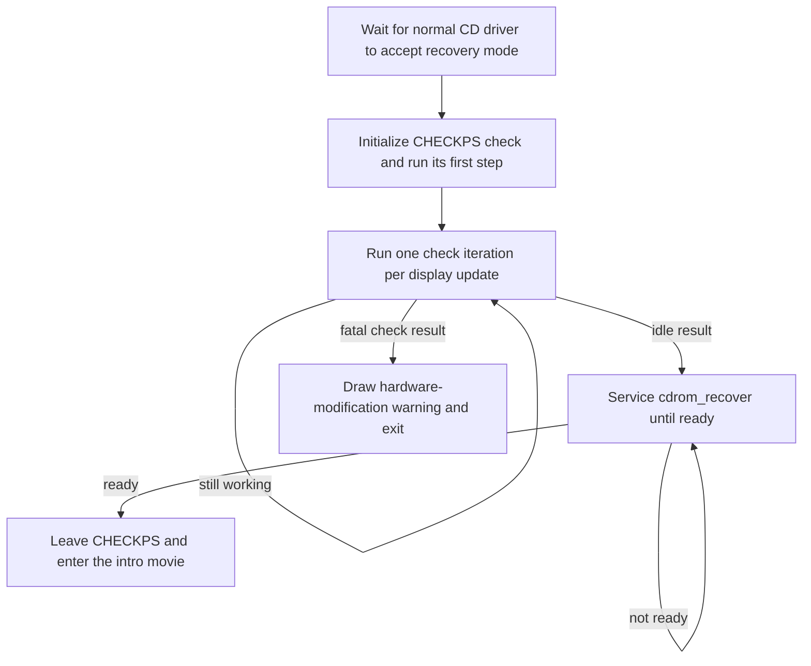

# CHECKPS: the startup screen and CD checks

[English documentation](../../README.md) | [Japanese](../../../jp/technical/architecture/checkps.md) | [CD-ROM subsystem](cdrom.md)

CHECKPS runs before the intro movie. In the US release, it displays an image
for a few seconds and returns. The Japanese release uses that time to run a
CD-controller check, and only leaves after the normal CD driver has been
restored.

That difference is easy to miss when reading the C. Both overlays contain the
check routines, but JP still takes its startup code from assembly. The US
startup loop doesn't call those routines. This page follows the two paths and
explains what happens if the check reaches the hardware-modification warning.

## Getting into CHECKPS

The main executable loads `CHECKPS.BIN` through the normal CD resource loader
and passes `run_checkps()` a rendering workspace at `0x80100000`. CHECKPS loads
at `0x8004FC70` in US and `0x8004FDD8` in JP. It uses the large overlay region
that FIELD later occupies, so FIELD isn't running underneath this screen.

The main executable handles the return differently in each release:

| Release | Entry | Return |
|---|---|---|
| US | Calls CHECKPS once before entering the main game-state loop | Already selected `GAME_STATE_INTRO_MOVIE`; ignores the function's return value |
| JP | Starts in game state 6, which loads and runs CHECKPS | Stores the returned value 8 as the next game state, starting the intro movie |

`run_checkps()` prepares the embedded audio bank and display, runs its own
rendering loop, and returns `GAME_STATE_INTRO_MOVIE` when that loop ends.
Unlike CARDA, it doesn't return to a caller after each frame.

Sources: [shared main loop](../../../../src/main/main.c),
[shared CHECKPS startup](../../../../src/overlays/checkps/init.c),
[game-state names](../../../../include/main/game_state.h).
The JP source locations are collected at the end of this page.

## The US screen runs on a timer

Display setup clears VRAM, creates two display/draw environments, resets the
glyph cache and starts a 20-update fade from black. It uploads the palette and
pixels from the embedded image and sets the display counter to 120.

Each loop builds the fade and image packets, updates input and the counter,
waits for drawing and `VSync(2)`, then swaps the buffers. It also services the
normal CD dispatcher with `cdrom_process_state()`. At the usual 60 Hz timing,
120 updates at two display intervals per update is roughly four seconds;
work that stalls the loop can make it longer.

When the counter reaches zero, `g_checkps_exit_reason` becomes 2 and the loop
ends. Input is sampled and debounced, but this path has no button test that
skips the screen. The exit condition here is the counter.

The audio setup registers an embedded AKAO bank and uploads its samples when
needed. Song-loading and playback helpers also exist in this unit, but the US
startup path doesn't call them just because they are present.

Source: [init.c](../../../../src/overlays/checkps/init.c), particularly
`run_checkps_display_loop()`, `init_checkps_display()` and
`update_checkps_input_and_timeout()`.

## JP takes control of the drive, then gives it back

JP's function named `update_checkps_input_and_timeout()` has a different job.
It advances a four-phase startup sequence. The name comes from the US version;
there is no 120-update countdown in this JP function.



The handoff starts with `cdrom_enter_recovery_mode()`. It only accepts a fresh
request when the normal command processor is idle, its queue is empty and no
recovery errors are pending. Once accepted, `CD_STATUS_RECOVERY_PENDING` keeps
the normal dispatcher from issuing more work. CHECKPS can then use its own
register-level command code.

JP calls `start_cd_integrity_check()`, followed by
`run_cd_integrity_check(1)`. On later display updates it keeps calling the
second function until it returns zero. It then services `cdrom_recover()` until
that returns nonzero, sets `g_checkps_exit_reason` to 2, and leaves the screen.
Finishing the check alone isn't enough; restoring the main driver's operating
mode is part of completing CHECKPS.

The JP display loop continues drawing while this happens. Its image routine
animates textured quads and can play sound effects, rather than using the
single centered sprite in the US implementation. This display code is also
still assembly. The check runs independently of the animation's progress.

The [CD-ROM guide](cdrom.md#explicit-reconfiguration-is-a-separate-protocol)
explains the main driver's recovery sequence. The CHECKPS caller is confirmed
in JP assembly: `update_checkps_input_and_timeout()` at `0x800506B8`, with its
startup phase stored in `D_80067E10`.

Sources: [main CD driver](../../../../src/main/cdrom.c),
[JP CHECKPS symbol map](../../../../config/jp/symbols/checkps_symbol_addrs.txt),
[regional CHECKPS startup](../../../../src/overlays/checkps/init.c).

## What the CD check does

CHECKPS has a separate command sender and response poller in
[cdrom.c](../../../../src/overlays/checkps/cdrom.c). They access the CD-controller
registers directly. They don't submit operations to the game's resource queue.
A command table supplies each opcode, parameter count, response length and
expected interrupt-code sum. The poller consumes responses and distinguishes
pending work, completion, disc errors and an open lid.

`start_cd_integrity_check()` selects the first state.
`run_cd_integrity_check(1)` evaluates one state-machine iteration and returns;
that iteration may still be waiting for a response. Passing zero instead keeps
iterating until the check is idle. JP uses the single-iteration form so its
screen can continue to update.

The main route through the check is:

| Phase | Commands and purpose |
|---|---|
| Find a position | `GetTN`, `Init` and `GetTD` obtain track information and prepare a seek position |
| Check identity | `ReadTOC` and `GetID`; a specific invalid-command response to `ReadTOC` takes a fallback directly to `Setloc` |
| Start the test | `Setloc`, `Setmode`, a delay, then `SeekP`, `Mute` and `Play` |
| Read the test result | `Test(0x04)`, another delay, then `Test(0x05)` |
| Finish | On the accepted test result, wait, issue `Pause`, and return to idle |

The delay thresholds are 3, 200 and 10 `VSync` intervals for seek, test and pause
respectively. The comparisons wait until the threshold has been exceeded, and
the caller's update rate affects when each transition is observed. These delays
aren't a timeout for the whole check.

Two routes reach the fatal warning. A disc-error result from `GetID` goes
there directly. After `Test(0x05)`, a nonzero byte at
`g_cd_response_payload[0]` selects a `Nop` confirmation step; completion of that
step goes to the warning. A zero byte follows the pause-and-finish route.

Other errors often restart the sequence. An open lid enters a `Nop` polling
path and restarts once the drive reports completion. There is no overall retry
limit in this state machine, so an unresolved drive problem can keep the JP
startup screen running. The return value is a state/result code, not a simple
pass/fail boolean; zero is the idle result the caller waits for.

These are the decisions visible in the program. We haven't established what
every test response means on each controller revision or modified console.
The warning's wording doesn't prove that every path reaching it identifies
the same hardware condition.

## The warning takes over the machine

The fatal path resets the GPU, stops callbacks and writes zero to the SPU
control register. It installs a fresh display environment, draws the warning
and diagnostic pattern, enables the display, and calls `exit()` through the
BIOS wrapper. It doesn't return to the normal startup screen or offer a retry.

The embedded message is Japanese in both releases. It says that execution has
been terminated and the console may have been modified. The renderer draws
three lines using glyphs from the BIOS Kanji ROM, with a second pass offset by
one pixel for the shadow. `pattern.c` adds the surrounding red quadrilaterals.

This path uses immediate GPU commands and its own Kanji drawing code. It can
build the warning after discarding the ordinary frame/callback setup. The
cached-font renderer in `font.c` belongs to the normal display machinery; it
isn't how this terminal warning is drawn.

Sources: [warning and exit path](../../../../src/overlays/checkps/cdrom.c),
[Kanji renderer](../../../../src/overlays/checkps/kanji.c),
[diagnostic pattern](../../../../src/overlays/checkps/pattern.c),
[BIOS exit wrapper](../../../../src/psyq/libc2/exit.c).

## Looking at the embedded resources

Each version's splat YAML keeps the initialized data in one `checkps_data`
blob. The warning text and quadrant signs are in a small `rodatabin` before
the code, while the runtime buffers stay in BSS. To see what's stored there,
run `make splat` for the version you want, then:

```sh
make extract-checkps
make extract-checkps VERSION=jp
```

The output goes under `assets/exports/<version>/overlays/checkps/`. It includes
the original TIM and a PNG for each palette, the decoded warning, and YAML
for the CD commands, register pointers, initial state, pattern tables and
digit glyphs. The US image is 256 x 48 with one palette; JP has a 256 x 256
texture with 16 palettes. The JP PNGs show the stored texture, before the
animation selects and moves its pieces.

The AKAO container and bank headers are decoded too, including the bank's 32
articulation entries. The program and ADPCM samples are preserved as binary
files; the extractor doesn't play or synthesize them. `byte-map.yaml` covers
both input files, including padding and the few trailing bytes that remain
unidentified. The build continues to link the original bytes.

See the [extractor guide](../../../../tools/data/overlays/README.md) for the file
layout and output options.

## Reading the regional sources

Both versions build CHECKPS and the main loop from shared C. Follow the
`VERSION_JP` branches in `src/overlays/checkps/init.c` and `src/main/main.c`
for the regional startup behavior.

After `make splat VERSION=jp`, the relevant generated files are
`asm/jp/main.s` and `asm/jp/overlays/checkps/init.s`. Useful places to start are:

| JP location | What to follow |
|---|---|
| Main-loop block at `0x800111B0` | Load CHECKPS for state 6 and store its returned game state |
| `init_checkps_display` at `0x80050030` | Initialize display resources and request CD recovery mode |
| `update_checkps_input_and_timeout` at `0x800506B8` | Acquire the drive, run the check and restore the main driver |
| `draw_checkps_image` at `0x80050788` | Update the JP animation and emit its GPU packets |
| `load_checkps_image` at `0x80050C2C` | Initialize animation records and clear the startup phase |

The calls and handoff above have been traced in that assembly. The reason the
US release retains the check without calling it from this startup path is
still unknown. Detailed names for the JP animation state and the physical
meaning of the controller tests also need more work; neither is necessary to
follow when CHECKPS starts, waits, exits or terminates the game.
