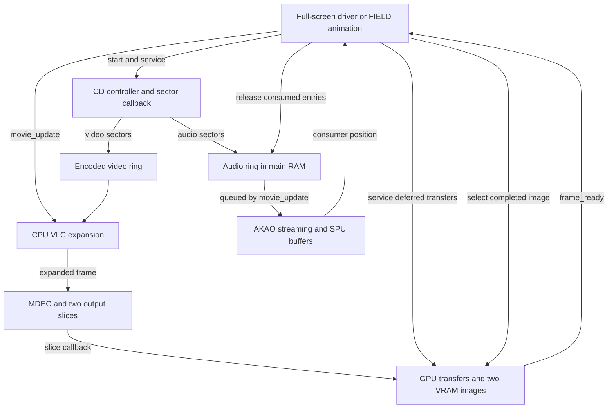
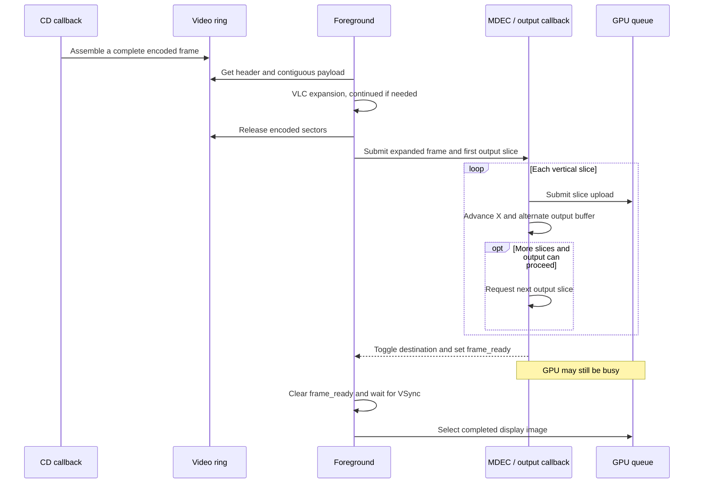
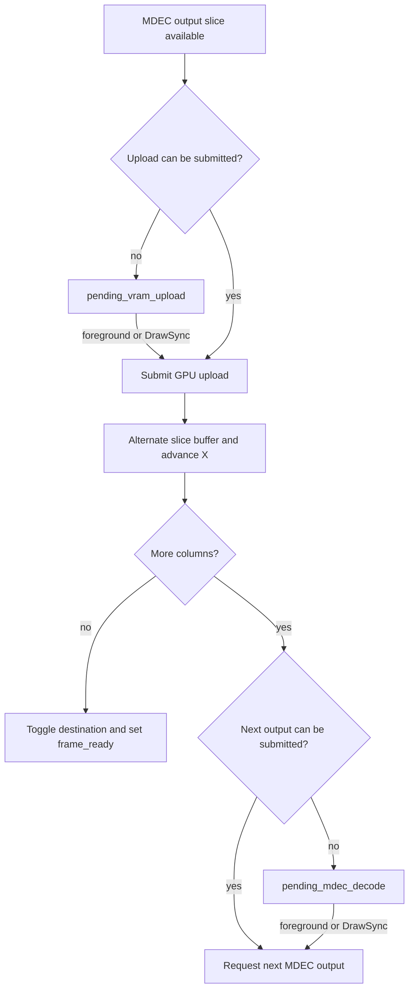
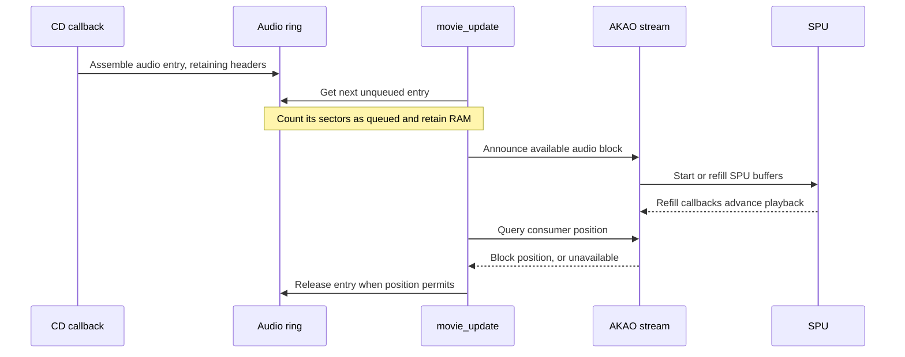
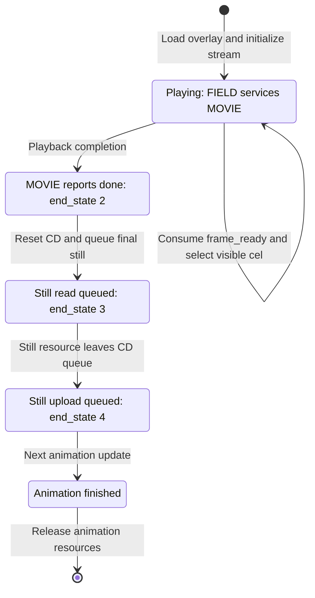

# MOVIE overlay architecture

[English documentation](../../README.md)

## High-level overview

The MOVIE overlay turns a disc stream into video in VRAM and, when enabled,
streamed audio through AKAO. It serves two callers: full-screen cinematics and
movies embedded in FIELD scenes. Both use the same sector buffers and decoder
pipeline; the caller determines where the image appears and when to leave
playback.

Video passes through three stages. The CPU expands variable-length codes (VLC)
from buffered disc sectors. The PlayStation motion decoder (MDEC) converts that
expanded data into image slices. The GPU transfers each slice into one of two
VRAM image regions. Audio follows a separate path from a RAM ring through AKAO
to the sound processor (SPU). Disc reads, CPU decoding, and hardware transfers
can overlap without allocating memory for each frame.

Three properties govern the design:

- **One playback session owns the pipeline.** The overlay uses fixed RAM,
  global state, and shared MDEC/GPU callback slots. Starting another movie is
  not an independent operation.
- **Buffer lifetime controls progress.** Encoded video can be released after
  VLC expansion. Audio remains reserved after it is queued to AKAO. Completed
  image slices and display images have their own separate buffer lifetimes.
- **The caller and callbacks cooperate.** The caller advances decoding and
  presents images; callbacks move sectors and chain hardware transfers. A
  caller that stops servicing the pipeline can prevent forward progress.

This document describes the matching implementation in
[movie.c](../../../../src/overlays/movie/movie.c) and
[movie_stream.c](../../../../src/overlays/movie/movie_stream.c), including behavior
retained from the original executable. Full-screen loop and skip details refer
to the US C implementation; JP still supplies `movie_play()` from assembly.
Drive command sequencing and recovery belong to the
[CD-ROM subsystem](cdrom.md).

## Components and ownership

| Component | Owns | Responsibility |
|---|---|---|
| `movie_play()` | Full-screen display environments and playback loop | Select a stream, service playback, present images, process skip input |
| FIELD animation code | Scene rectangles, cels, decode workspace, final still image | Embed playback in the scene and resume scene animation afterward |
| `movie_init()` | Session setup | Select memory layout, initialize state, install callbacks, queue the stream |
| `cd_sector_callback()` | Ring producer positions and partial-frame assembly | Classify sectors and assemble contiguous video/audio entries |
| `movie_update()` | VLC work and consumer progress | Expand video, submit MDEC input, queue audio, retire consumed entries |
| MDEC/DrawSync callbacks and `movie_service_video_ops()` | Slice output and deferred GPU/MDEC work | Upload slices, chain output transfers, publish completed images |
| Main CD controller | Physical drive, request queue, error recovery | Deliver sectors and restore streaming after drive errors |
| AKAO | Audio playback position, SPU voices and transfers | Consume the RAM stream and refill SPU buffers |

`MovieState` lives at `0x801ED500`. Some separately named globals are aliases
into this shared state, not additional playback instances. The MOVIE overlay
loads at `0x80140000`; its main buffer arena begins at `0x80147000`.

### Execution context

There is no worker thread. Foreground code and callbacks share the same state
on one CPU, with hardware transfers continuing between calls.

| Work | Execution context |
|---|---|
| Initialization, VLC expansion, audio queueing, presentation | Calling game or FIELD code |
| Sector ingestion | CD sector processing, including its deferred-service path |
| Completed MDEC output | `movie_mdec_out_callback()` |
| Deferred GPU/MDEC work | `draw_sync_callback()` or foreground `movie_service_video_ops()` |
| SPU refill and playback position | AKAO's audio callback machinery |

`video_service_busy` keeps the DrawSync callback out while foreground video
servicing handles the same pending requests. Foreground code sets the guard
and rechecks the request because a callback may already have serviced it.
This guard and the volatile handshake fields do not make the subsystem
reentrant or suitable for multiple simultaneous movies.

Sources: [shared state](../../../../include/movie_state.h),
[overlay header](../../../../src/overlays/movie/overlay_header.c),
[stream callbacks](../../../../src/overlays/movie/movie_stream.c).

## Playback modes and public contract

The public entry points are declared in [movie.h](../../../../include/movie.h).

| Entry point | Contract |
|---|---|
| `movie_play(movie_index)` | Run a full-screen cinematic until completion or an accepted skip |
| `movie_init(resource_index, flags, total_frames, init_buffer_idx)` | Initialize one session and queue its resource through the CD controller |
| `movie_update()` | Advance VLC/MDEC input and enabled AKAO streaming; call repeatedly |
| `movie_service_video_ops()` | Retry pending slice uploads and MDEC output transfers |
| `cdrom_reset()` | End streaming, restore the saved callbacks, and clear CD state |

The lower seven bits of `flags` select the GPU mode. Zero selects the standard
full-screen layout; nonzero selects the alternate layout. Bit `0x80` enables
the AKAO RAM stream. These are independent choices: FIELD passes `1`, while
the full-screen driver passes `0x80`.

| Property | Full-screen driver | FIELD integration |
|---|---|---|
| Presentation | 320 x 240 RGB24 display | Caller-supplied scene image rectangles |
| Destination pair | VRAM at `(0, 0)` and `(0, 240)` | Derived from FIELD's first rectangle |
| Upload slice width | 24 VRAM halfwords | 16 VRAM halfwords |
| Slice height | 240 | Height supplied by FIELD |
| Video ring capacity | 50 sectors | 30 sectors |
| VLC table and output slices | Fixed MOVIE arena | FIELD scene workspace |
| Frame presentation | `PutDispEnv()` after `VSync(0)` | Select the visible cel |
| After playback | Stop streaming and disable display output | Load and queue a final still image |

VRAM rectangle widths are in 16-bit units. A 320-pixel RGB24 image occupies
480 of those units, and a 24-unit slice contains 16 pixels across. The standard
path therefore uploads 20 vertical slices per image. The two slice buffers in
RAM are much smaller than two complete decoded images.

In alternate mode, `rects[0]` and the initial buffer index come from the caller.
Normally the second rectangle starts immediately to its right. If the first
rectangle's X coordinate is at least 768, the second instead starts at
`(512, 0)`. Width and height are copied from the first rectangle. The scene
layout must accommodate this placement and the fixed decode workspace.

### Initialization and teardown

Initialization selects the memory layout, resets ring and pipeline state, and
installs MDEC-output and DrawSync callbacks while saving the previous handlers.
For streamed audio it registers the audio ring with AKAO and sets volume to
127. It then waits for the CD queue to empty and submits a logical `CdlReadS`
request with `cd_sector_callback()` as the transfer callback. The CD controller
owns the resulting drive-command sequence.

Standard mode also clears its VRAM images and builds the VLC table. FIELD
builds the table in its scene workspace before calling `movie_init()`.
Initialization contains blocking operations; queueing the stream does not
make the entire entry point nonblocking.

Teardown crosses the overlay boundary. `cdrom_reset()` restores the saved
MDEC/DrawSync callbacks, clears CD callbacks and queue state, pauses the drive,
and stops the enabled AKAO stream. It is a global reset, not cancellation of
one isolated request. The US full-screen driver also resets controller timing,
waits for drawing and VSync, and disables display output. It does not restore
a previous display environment itself.

Sources: [initialization and full-screen driver](../../../../src/overlays/movie/movie.c),
[FIELD workspace setup](../../../../src/overlays/field/field_scene_build.c),
[FIELD caller](../../../../src/overlays/field/field_animation.c),
[CD teardown](../../../../src/cdrom.c).

## Memory layout and buffer lifetime

The layouts are fixed for the original 32-bit target. Sizes below are reserved
RAM, not measured peak usage; they exclude overlay code, shared state, VRAM,
and other scene or audio allocations. One KiB is 1024 bytes.

| Allocation | Standard layout | Alternate layout |
|---|---:|---:|
| Video headers and payloads | 50 x 2048 = 100 KiB | 30 x 2048 = 60 KiB |
| Audio ring | 16 x 2048 = 32 KiB | 16 x 2048 = 32 KiB |
| VLC lookup table | 68 KiB | 68 KiB in FIELD workspace |
| Two expanded-frame buffers | 2 x 80 = 160 KiB | 2 x 68 = 136 KiB |
| Two MDEC output slices | 2 x 11520 = 22.5 KiB | 2 x 7680 = 15 KiB in FIELD workspace |
| **Total** | **382.5 KiB** | **311 KiB, including 83 KiB owned by FIELD** |

The standard arena occupies `[0x80147000, 0x801A6A00)`. The alternate arena
occupies `[0x80147000, 0x80180000)` and uses another `0x14C00` bytes through
`g_field_scene.scene->vlc_table`. That FIELD allocation holds both the table
and the output slices despite the field's narrower name. Alternate mode
reserves its audio ring even when streamed audio is disabled.

Several independent pairs of buffers exist:

| State | What alternates | When ownership advances |
|---|---|---|
| `input_buf_idx` | Expanded video frames, named `vlc_input_buf` because they feed MDEC | When VLC begins the next encoded frame |
| `out_buf_idx` | MDEC output slices | After an upload is submitted and the slice position advances |
| `chunk_idx` | VRAM destination images | After the last slice of the current image is submitted |

After `chunk_idx` changes, it identifies the next image to write. The completed
image is the other one. Confusing this index with the currently displayed
image reverses presentation.

| Storage | Producer | Lifetime boundary |
|---|---|---|
| Encoded video ring | CD sector callback | `advance_video_read()` after VLC expansion completes |
| Expanded-frame buffer | CPU VLC decoder | Reused after its prior MDEC use finishes, through buffer alternation and admission checks |
| MDEC output slice | MDEC output transfer | Upload/chaining rules allow reuse through the alternating slice buffers |
| Audio ring entry | CD sector callback | AKAO consumer position allows `advance_audio_read()` |
| VRAM image | Slice upload pipeline | Caller consumes `frame_ready` and presents the completed image while the other becomes the next destination |

Sources: [buffer layouts](../../../../src/overlays/movie/movie.c),
[sector types](../../../../src/overlays/movie/movie_internal.h),
[FIELD allocation](../../../../src/overlays/field/field_scene_build.c).

## Disc stream and ring protocol

The movie callback consumes a 2048-byte logical sector: a 32-byte movie header
and 2016 payload bytes. This header follows the CD controller's own sector
handling; it is not the physical CD sector header or XA subheader.

| Header offset | Field | Meaning used by MOVIE |
|---|---|---|
| `0x00` | `u16 unknown` | Not interpreted here |
| `0x02` | `u16 sector_type` | `0x8001` for video; audio continuations require `1` |
| `0x04` | `u16 chunk_sector_idx` | Sector index within this multi-sector entry |
| `0x06` | `u16 sector_count` | Number of sectors reserved for the entry |
| `0x08` | `u32 frame_number` | Stream position and stopping comparisons |
| `0x0C..0x1F` | Remaining metadata | Preserved without interpretation by the ring code |

Video headers and payloads go into parallel arrays. Removing the headers from
the payload sequence gives VLC a contiguous bitstream. Audio retains complete
2048-byte sectors because the AKAO stream consumes that layout.

A new entry must start with sector index zero. The producer reserves room for
the whole entry, either at the current write position or at the beginning of
the ring. On a wrap, it records the end of the older contiguous segment in a
wrap index. Frames are not split across the end of the allocation.

Continuations must have the expected type, frame number, and next sector
index. There is one shared continuation state, so the implementation expects
an entry's sectors in sequence, rather than tracking multiple interleaved
partial entries. A mismatch abandons the partial entry; subsequent sectors
must establish a new start, subject to the end-of-stream checks.

The indices alone do not distinguish full from empty. Equal read and write
indices mean empty only when the last-produced and last-consumed frame markers
also agree. Completion advances the producer's frame marker and write position;
wrapping can reset the write position earlier during reservation. Consumers
also use the recorded wrap boundary to leave the older segment.

If an entire entry cannot fit, the callback continues the disc read without
buffering it. Following continuation sectors are skipped until another start
sector is encountered. **Ring exhaustion can drop incoming entries.** There
is no lossless producer wait or per-frame retry queue here.

The callback's return value is a control token: `NULL` stops the read and
`(u8*)1` continues it. The caller does not dereference that value. The generic
byte-count arguments are unused because this protocol uses its own headers.

Source: [sector ingestion and ring consumers](../../../../src/overlays/movie/movie_stream.c).

## Video pipeline

The following sequence shows a standard-mode image with no deferred transfers.
It shows ordering, not elapsed time. CD ingestion and VLC work for later images
can overlap output of the current image.

### VLC expansion and MDEC admission

`movie_update()` starts VLC in the other expanded-frame buffer. If the SDK
reports unfinished work, later calls continue it with `DecDCTvlc2(NULL, NULL,
table)`. Standard mode starts with a work limit of 4096 and continuation counter
3; alternate mode uses 5802 and 1. When the counter reaches zero, the code calls
`DecDCTvlcSize2(0)` before continuing. These are decoder scheduling settings,
not a count of corrupt-frame retries.

Once VLC completes, the encoded sectors can be released even if MDEC is still
busy with the preceding image. Submission requires both `mdec_busy == 0` and
`frame_ready == 0`. Otherwise `mdec_retry_pending` holds the expanded frame
until those conditions become true. While that flag remains set, no new VLC
frame begins. This allows preparation ahead of MDEC without an unbounded queue
of expanded images.

### Slice transfers and deferred work

In standard mode, the MDEC-output callback polls `DrawSync(1)`. With a result
below 2 it queues `LoadImage()` and records the draw status plus one. Otherwise
it sets `pending_vram_upload` and leaves the slice waiting in RAM.

After submitting an upload, `movie_schedule_next_decode()` alternates output
buffers and advances the slice rectangle horizontally. If more columns remain,
it either requests another `DecDCTout()` or sets `pending_mdec_decode`, depending
on `draw_sync_target`. At the right edge it switches the destination image,
resets the slice coordinates, marks MDEC idle, and sets `frame_ready`.

These two pending requests represent different stopping points:

This is the standard-path work flow, not a one-to-one diagram of `mdec_busy`.
That field uses 0 for idle, 1 for active/deferred work, and 2 for chained output;
the pending flags describe what must actually happen next.

Alternate mode integrates uploads with FIELD drawing. The output callback
tries `BreakDraw()`, uses `LoadImage2()` when successful, and resumes a saved
ordering table with `DrawOTag()` if present. If `BreakDraw()` fails there, it
falls back to `LoadImage()`. In the foreground alternate service path, a failed
`BreakDraw()` instead leaves a pending upload for a later call.

`frame_ready` is published after the final upload has been submitted. It does
not independently prove that the GPU has finished every transfer. The caller's
presentation sequence and GPU scheduling remain part of the contract.

Sources: [VLC and MDEC input](../../../../src/overlays/movie/movie.c),
[output and deferred servicing](../../../../src/overlays/movie/movie_stream.c).

## Audio pipeline and synchronization

Several function and field names say "XA" or "CD audio," but the enabled movie
stream follows a RAM-to-SPU path. `akao_start_xa_stream()` registers the
32 KiB audio ring. AKAO's stream implementation selects an SPU voice pair,
transfers data with `SpuWrite()`, and uses callbacks to refill its SPU buffers.
The MOVIE audio ring is not merely handing sectors to the drive's XA decoder.

MOVIE and AKAO have separate responsibilities. `get_next_audio_entry()` finds
the next entry not already queued and adds its sector count to
`audio_buffered_count`. `akao_xa_advance_frame()` announces that another audio
block is available. Neither operation releases the RAM entry.

The consumer position is expressed in two-sector audio blocks. `movie_update()`
compares `audio_read_idx` with twice that position and retires an entry when
its conditions permit. AKAO startup can begin after two blocks have been
announced. Its SPU buffers provide a further stage beyond the main-RAM ring.

The overlay has no explicit presentation-timestamp scheduler that aligns each
video image with a corresponding audio block. It advances each side as its
buffers and hardware permit. `current_frame` records a processed stream header
and can be updated by either video or audio; it is not a count of images
actually shown on screen.

### Audio after CD recovery

The CD controller pauses the AKAO stream during recovery. On successful drive
recovery, it sets `audio_stream_state` to 1 for a movie using streamed audio.
The sector callback's new-entry audio branch changes 1 to 2; `movie_update()`
then waits for at least half the ring, eight sectors, to be counted as queued
before sending the AKAO resume command and clearing the state.

| Value | Meaning in the recovery handshake |
|---|---|
| 0 | Normal state; no recovery re-prime request pending |
| 1 | CD recovery requested audio re-priming |
| 2 | Audio branch observed; resume when the queued-sector threshold is met |

This is a recovery handshake, not a mandatory eight-sector wait at ordinary
startup. The change from 1 to 2 happens in the audio branch even if that entry
could not fit, so state 2 alone does not prove data was successfully buffered.

Sources: [MOVIE audio servicing](../../../../src/overlays/movie/movie.c),
[AKAO commands and position tracking](../../../../src/akao_cmd.c),
[AKAO SPU stream](../../../../src/akao_xa_stream.c),
[CD recovery coordination](../../../../src/cdrom.c).

## CD coordination and timing

For standard movie playback, the CD ready handler can defer sector processing
while MDEC is busy. It sets `data_ready_pending` instead of immediately invoking
the movie sector callback. The MDEC-output callback checks that flag and calls
`cdrom_verify_recovery()` before its GPU upload work. Despite its name, that
function services deferred sector data here; it is not an independently
installed ready callback or proof that recovery is underway.

The CD supervisor can also call `movie_service_video_ops()` while its streaming
mode is active. The caller, CD controller, and output callbacks therefore form
one progress mechanism. Drive retries and watchdogs remain in the CD subsystem.
The US full-screen loop services transient CD errors through VSync, controller
updates, and `cdrom_process_state()`. Error status 5 bypasses that wait; the
loop does not treat it as an unconditional immediate exit.

A timing table is more useful here than a cycle-accurate waveform: the code
establishes ordering and work budgets, but does not provide measured transfer
latencies or a fixed movie frame rate.

| Mechanism | What the implementation establishes |
|---|---|
| `VSync(0)` before full-screen presentation | Presentation follows a vertical-blank wait |
| `set_controller_vsync_interval(4)` | Controller sampling/accumulation policy; it does not wait four VBlanks |
| 8192 update iterations | Polling budget before another CD supervision call; not milliseconds or a playback timeout |
| VLC limits 4096 / 5802 | Work limits passed to the SDK, not frame periods |
| Eight queued audio sectors after recovery | Resume threshold for the recovery handshake, not a universal startup latency |
| Skip audio fade, 112 down to 0 in steps of 16 | One volume update per full-screen outer-loop iteration while fading; no fixed duration in milliseconds |

In particular, the controller interval of 4 does not establish 15 fps. Actual
progress depends on encoded data, decode work, disc delivery, GPU availability,
and caller servicing. `CdGetSector()` polling, drive pause loops, `DrawSync(0)`,
and VSync waits also mean there is no general bounded-latency API guarantee.

Sources: [CD streaming callbacks](../../../../src/cdrom.c),
[full-screen loop](../../../../src/overlays/movie/movie.c),
[controller timing](../../../../src/controller.c).

## Completion and FIELD handoff

`total_frames` supplies a stream-header stopping boundary. The comparisons are
not uniform: video uses `>=` in its completed-frame and near-end paths, while
audio uses `>` in its corresponding paths. The new-entry sector check also
stops on a header beyond the boundary. It should not be interpreted as an
independent count of successfully presented images.

| `end_state` | Owner | Meaning |
|---|---|---|
| 0 | MOVIE | Running |
| 1 | MOVIE | Video at or beyond the configured boundary has entered decoding |
| 2 | MOVIE | Playback done; caller can tear down the stream |
| 3 | FIELD | Final still-image read queued after movie teardown |
| 4 | FIELD | Still-image upload queued and cel state updated |

The usual video route reaches state 2 when the output scheduler finishes the
image while state 1 is set. `movie_update()` can also set done when no video
entry is available, end-of-stream is flagged, and MDEC is idle, or when an audio
header exceeds the boundary. These are alternate completion paths, not one
single universal "last frame displayed" event.

FIELD extends the shared state with its own two post-playback values:

FIELD supplies the image rectangles and calls both `movie_update()` and
`movie_service_video_ops()` during playback. It consumes `frame_ready` by
switching cels. After completion it calls `cdrom_reset()` and reads the final
still into `FIELD_MOVIE_BUFFER`, reusing the region that held the MOVIE overlay.
States 3 and 4 are handled in FIELD without further calls into MOVIE. Once the
still is available, FIELD queues its VRAM upload and updates visibility; a
later animation update deactivates the animation and resets actor resources.
Some scene transitions also begin a fade-in.

The name `FIELD_MOVIE_END_STILL_SHOWN` for state 4 should not be read as an
independent GPU completion fence: the code has queued the upload at that point.

Sources: [completion checks](../../../../src/overlays/movie/movie.c),
[final-slice handling](../../../../src/overlays/movie/movie_stream.c),
[FIELD lifecycle](../../../../src/overlays/field/field_animation.c).

## Assumptions and remaining questions

The fixed layouts, direct word copies, narrow rectangle coordinates, and
callback flags fit the hardware and ownership model. They are not, by
themselves, evidence of a missing abstraction. The following limitations need
separate attention if this implementation is changed or reused:

- **Audio wrap inconsistency.** `advance_audio_read()` compares against
  `video_wrap_idx`, whereas audio entry lookup uses `audio_wrap_idx`. This
  behavior is present in the original US and JP code. Its practical effect
  requires tracing real ring positions and stream data; changing the field
  would change behavior rather than merely improve readability.
- **Trusted stream structure.** The new-entry path treats any non-video type
  as audio, while audio continuations require type 1. Sector counts and frame
  layout are assumed to fit the fixed buffers. This is not a general parser
  for arbitrary or damaged media data.
- **Entry loss under pressure.** A full ring can discard incoming entries.
  There is no explicit audio/video resynchronization policy in MOVIE that
  establishes the visible or audible result of every such loss.
- **Partly understood metadata.** The first header halfword and the remaining
  20 metadata bytes have no established meaning in this module. Preserving
  them does not establish a complete file-format specification.
- **Regional driver differences.** The common C pipeline is documented here,
  but JP's assembly-backed `movie_play()` needs separate analysis before
  extending US skip and presentation-loop claims to that version.

The sequence diagrams describe code ordering, not measured timing. Runtime
traces would be needed to quantify throughput, buffer occupancy, A/V drift,
and the effect of the audio wrap inconsistency. Those questions remain open;
the document does not assume that a binary match answers them.

## Source map

| Source | Architectural role |
|---|---|
| [movie.h](../../../../include/movie.h) | Caller-facing entry points |
| [movie_state.h](../../../../include/movie_state.h) | Shared state, callbacks, indices, and flags |
| [movie_internal.h](../../../../src/overlays/movie/movie_internal.h) | Stream headers, sector geometry, and pipeline constants |
| [movie.c](../../../../src/overlays/movie/movie.c) | Memory layouts, initialization, full-screen driver, VLC/audio servicing |
| [movie_stream.c](../../../../src/overlays/movie/movie_stream.c) | Sector producer, ring consumers, slice output, deferred work |
| [cdrom.c](../../../../src/cdrom.c) | Drive ownership, deferred sector delivery, recovery, teardown |
| [akao_cmd.c](../../../../src/akao_cmd.c) and [akao_xa_stream.c](../../../../src/akao_xa_stream.c) | Audio queue tracking and RAM-to-SPU streaming |
| [field_scene_build.c](../../../../src/overlays/field/field_scene_build.c) | FIELD-owned decode workspace |
| [field_animation.c](../../../../src/overlays/field/field_animation.c) | Embedded playback, cel presentation, final-still handoff |
| [controller.c](../../../../src/controller.c) | Controller VSync interval behavior |
