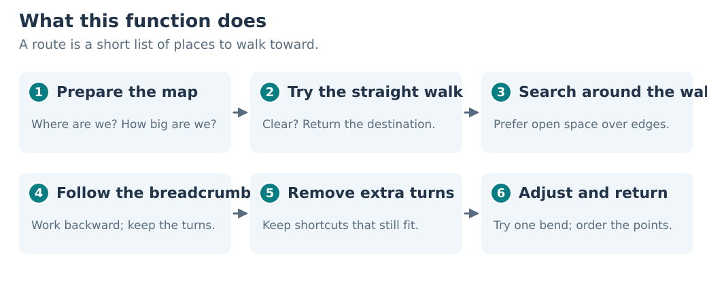
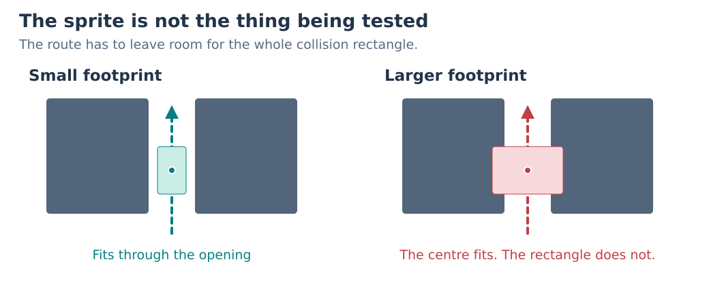
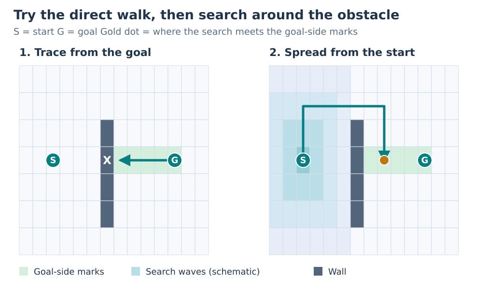
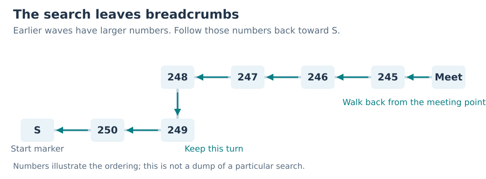
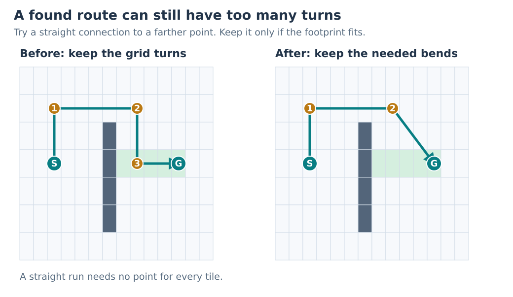
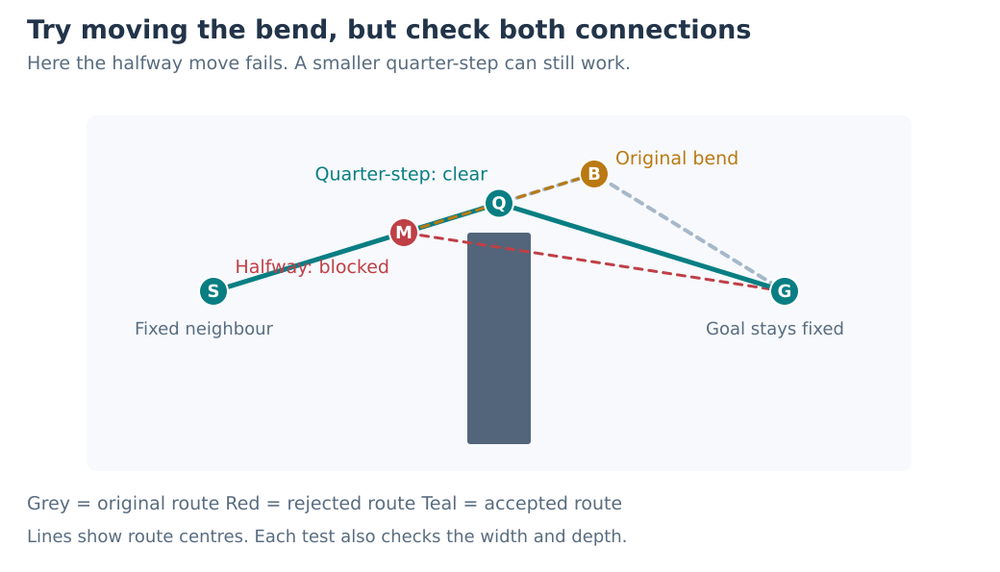

# How field pathfinding works

[English documentation](../../README.md) | [Japanese](../../../jp/technical/reference/field-pathfinding.md) | [Collision source](../../../../src/overlays/field/field_collision.c)

We have a character on one side of a wall and a destination on the other. We
want the character to walk around it without getting stuck on the corner.
That sounds simple enough, but there's a fair amount of work between picking
the destination and having a route the character can use.

`field_collision_find_path` does that work. It takes a starting position, a
destination, and the character's collision size. It returns a list of points
to walk toward. The code that moves and animates the character uses that list
afterward.

Let's follow one route around a wall. We can leave the pointer arithmetic and
queue bookkeeping in the source for now and focus on what each part is trying
to do.

The pictures are simplified examples, not screenshots or recorded searches.
`S` is the start and `G` is the goal. The dark blocks are walls. The grid views
show the ground from above; the game's collision tiles are twice as deep as
they are wide.

## First, make sure the character fits

A character's collision footprint is a rectangle on the ground. Its width and
depth matter even when the destination itself is just a point. A line drawn
through an opening might fit while the character following it doesn't.

The function uses the starting query's width and depth throughout the route.
The destination query supplies a position; its own width and depth aren't
used. That makes sense here: we're moving the same character from one place
to another.

Before calling this function, the actor code prepares the collision map for
that footprint. This marks blocked space and tiles near walls. The search
uses those prepared tiles, and the straight-walk tests check the full
rectangle as it moves along a segment.

The function also converts the positions into grid coordinates and selects
the collision floor using each position's height. A floor here means a group
of collision tiles at a particular height, rather than a visible texture. It
selects the floor at or below that height, using the lowest floor if the
position is below them all. It doesn't build stairs or connections between
floors.

Internally, positions refer to a corner of the footprint. When the function
writes the final points, it converts them back to the character's centre.
We don't need to keep switching between those two views to follow the route;
the pictures use small markers to keep things readable.

## Try the straight walk before doing a search

If the character can walk directly to the destination, we only need one
point: the destination itself. There's no reason to search the rest of the
map or invent extra turns.

The straight-walk test starts at the **goal** and heads toward the start. It
slides the footprint along that line, checking the tiles it covers. As it
goes, it marks tiles with the goal marker.

In our example, the wall stops the test. But the tiles checked on the goal's
side have already been marked. Those marks give the later search somewhere
to aim for. It can meet this marked corridor instead of having to reach only
the single tile containing `G`.

This is an easy detail to miss in the source. The direct test is also setting
up the search that follows it.

There are two other quick exits. If the start and goal share the same tile,
the function returns the destination. A scene with no collision floor groups
also gets that one-point result. That last case is a fallback for the absence
of a floor map, rather than a successful obstacle search.

## Spread out from the start

With the direct walk blocked, the function starts exploring from `S`.
Think of waves spreading across the available floor. Each wave checks the
neighbours of the tiles reached so far, then leaves the next tiles for a
later wave.

There are eight possible directions: four along the grid and four diagonals.
A diagonal has an extra corner test. Both side tiles must be open, with
compatible near-wall markings. An open diagonal destination doesn't let the
search pass between blocked corners.

Tiles marked as near a wall wait longer before they spread the search. This
gives routes through open floor a head start. For a game character, that's
useful: we generally want some room around a corner rather than a route that
hugs every obstacle.

The four rotating queues in the source manage these waves and waiting tiles.
They aren't four separate paths. Much of the long middle section is the same
neighbour-handling work repeated for the different directions.

Once a wave meets the goal-side marks, the function finishes that wave and
stops searching. The gold dot in the picture is that meeting point. It's
still some distance from the actual destination, so there is more work to do.

This search prefers open space, but we shouldn't call its result the shortest
possible route. It also has limits on how far it can search and how many
entries it can keep.

## Follow the breadcrumbs back

The search writes numbers into the tiles it visits. Those numbers decrease
as the waves spread outward. Earlier tiles generally have larger numbers,
so the function can use them as breadcrumbs back toward the start.

First it tries to connect the exact goal to the meeting tile. If a direct
connection fails, it tries the original goal-to-start line again, this time
stopping when it reaches the meeting tile. These tests also leave marks for
rebuilding the route. If neither connection works, reconstruction begins at
the goal tile instead and still has to find a usable trail back.

To walk backward, the function chooses the valid neighbouring tile with the
largest stamp above the current one. It repeats that until it reaches the
start marker. A trail that runs out produces an error.

We don't need a waypoint for every tile along this walk. If the direction
stays the same, the character can keep walking. The function records a point
when the direction changes, keeping the turns rather than every small step.

At this stage, the stored route runs **from the goal back toward the start**.
That explains why some of the later code appears to work in reverse.

## Remove turns we don't need

Following the grid gives us a route, but it can leave turns that serve no
purpose once we're allowed to walk in a straight line between points.

The function starts at the goal end of the stored route. From each point,
it tests a straight connection to the farthest remaining point first. If
that fails, it tries a nearer point. When a connection is clear, it skips the
turns between them.

For example, the first route in the picture goes up, across, down, and across
again. The second route still needs both upper bends to get around the wall,
but it can walk straight from the second bend to the destination. That last
extra turn isn't helping anymore.

Every shortcut gets the same footprint test. We aren't just drawing a line
that misses the wall; we need enough room for the character following it.
These later tests check the route without overwriting the search stamps.

## Give the bend near the goal a smaller adjustment

After removing unnecessary turns, the function may adjust the **bend nearest
the goal**. This is a limited pass, enabled when the search met the goal-side
corridor away from the exact goal tile. It doesn't adjust every bend or turn
the route into a curve.

It takes three neighbouring points: the goal-side point, the bend, and the
point on the start side. The two neighbours stay fixed. Only the bend moves.

First it tries moving the bend halfway toward the start-side neighbour.
**Both new segments must pass the footprint test.** A move that improves one
segment but sends the other through the wall is rejected.

If the halfway move works, it tries one more halfway move in the same
direction. If the first move fails, it tries a smaller quarter-step instead.
The picture shows why that smaller attempt can help: the halfway point cuts
through the wall, while the quarter-step still leaves a usable route.

It then repeats these attempts toward the goal-side neighbour, starting from
any adjustment already accepted. The final bend position is written back
only if an adjustment passed both connection tests. Otherwise, the old bend
stays where it was.

## Hand the route back to the movement code

The points have been stored backward, so the function reverses their order
when writing the result. The caller gets the next point nearest the start
first, followed by points farther along the route. The current starting
position isn't an extra waypoint; the character is already there.

There is room for at most 16 returned points. If the route needs more, the
function keeps the points nearest the start. That means a capped result may
not include the destination. A normal direct route returns just the goal.

The returned points contain ground positions, `x` and `z`. They don't
describe animation, walking speed, or a vertical movement plan. The actor
code handles movement after receiving them.

If something fails, the function returns a negative result:

| Result | What happened |
| --- | --- |
| `-1` | The scene has floor groups, but their working collision maps are missing. |
| `-2` | A start or goal position is outside the usable grid border. |
| `-3` | The search exhausted its available waves or had nothing left to explore. |
| `-4` | A search queue or the temporary route ran out of room. |
| `-5` | Reconstruction couldn't find the next breadcrumb toward the start. |

A failed search doesn't decide what the actor does next. The two actor-script
call sites in [the movement code](../../../../src/overlays/field/field_actor_script_ops.c)
fall back to a one-point destination when this function fails. So seeing a
character still try to move doesn't, by itself, mean pathfinding succeeded.

## Finding these parts in the source

Once the route makes sense, the long function is a little easier to read.
These are the main landmarks in
[`field_collision_find_path`](../../../../src/overlays/field/field_collision.c):

| What we're following | Where to look |
| --- | --- |
| Prepare positions and floors | The opening checks and the `start_group` / `goal_group` selection. |
| Attempt the direct walk | The first `field_collision_trace_line(&trace)` call. |
| Spread the search | The `while (1)` loop and its repeated neighbour blocks. |
| Connect the goal and follow breadcrumbs | The code after the wave loop, then the `previous_direction` backtracking loop. |
| Remove turns | The block commented "Keep the farthest visible point". |
| Adjust the goal-side bend | The block commented "Smooth the bend nearest the goal". |
| Return the points | The final reverse-order output loop. |

`field_collision_trace_line`, just below this function, is the shared
straight-walk test. The direct attempt, goal connection, shortcuts, and bend
adjustments all use it. Keeping that one operation in mind helps explain why
the same call appears so many times.
