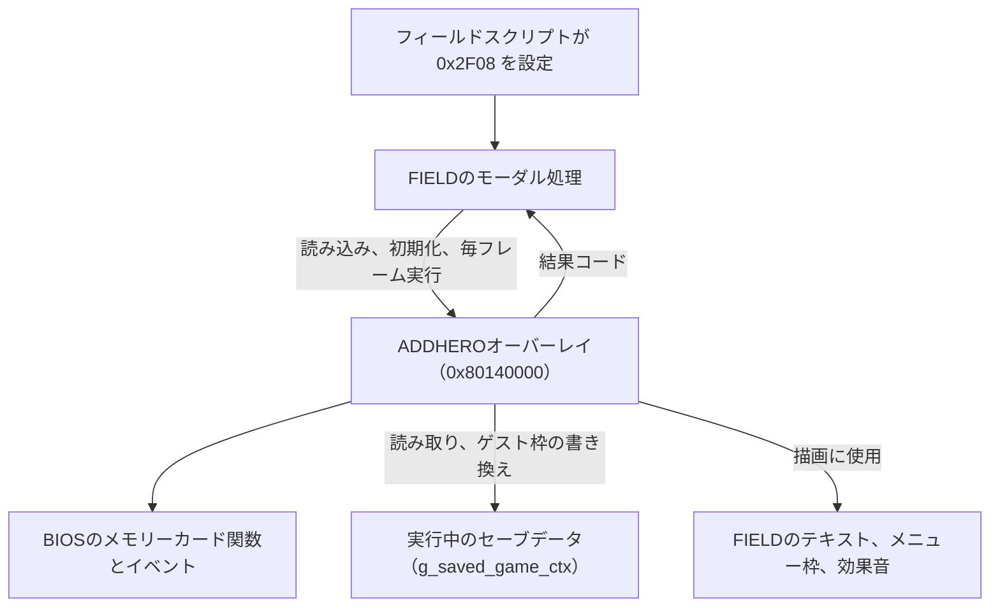
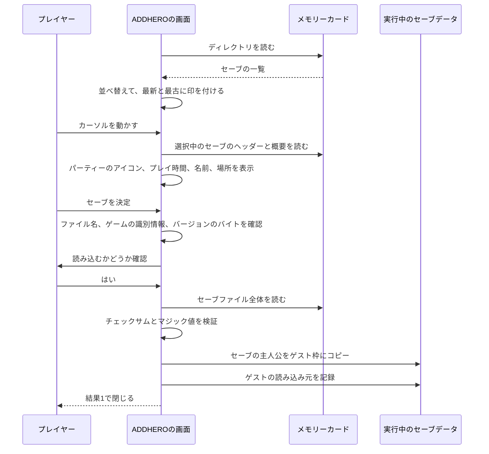
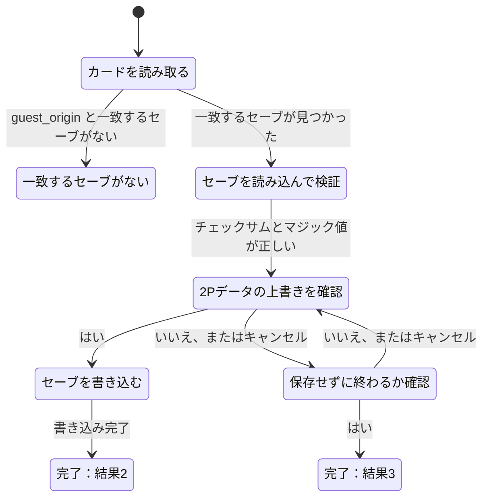

# ADDHEROオーバーレイの構成

[日本語ドキュメント](../../README.md) | [English](../../../en/technical/architecture/addhero.md) | [セーブファイルの形式](../reference/save-file.md)

## 概要

『聖剣伝説 LEGEND OF MANA』では、2人目のプレイヤーが自分の主人公を連れて参加できます。
友達がメモリーカードを持ってきて、ゲームがそのセーブから主人公を読み込むと、その主人公がゲストとして一緒に歩き回ります。
遊び終わったら、ゲストの成長をその人のカードに書き戻せます。
この2つの処理を担当しているのが、ADDHEROオーバーレイです。

小さなオーバーレイですが、ゲームのいろいろな部分に一度に関わります。
BIOSを通してメモリーカードを読み書きし、実行中のセーブデータを書き換え、FIELDが常駐したまま自分のメニュー画面を描画します。
ここで問題が起きると、他人のカードにあるセーブを壊してしまうおそれがあります。
そのため、コピーする前に確認し、検証を通らないファイルは信用しない、という方針が設計の大部分を占めています。

ADDHEROには2つのモードがあります。

| モード | プレイヤーに見えるもの | 処理内容 |
|---|---|---|
| 0 | メモリーカードのスロット1または2のセーブ一覧 | 他のプレイヤーのセーブから主人公を読み込み、ゲスト枠に入れる |
| 1 | ステータスウィンドウが1つだけ | ゲストの読み込み元のセーブを探し、ゲストをそこへ書き戻す |

このドキュメントでは、FIELDがどのように起動するか、それぞれのモードの流れ、カードアクセスの仕組み、まだわかっていないことを順に説明します。

## ADDHEROの位置付け

ゲームループを持っているのはFIELDです。
2Pの画面を開くとき、FIELDはスクリプト変数 `0x2F08` を確認します。`0xFF` ならモード0、`0x80` ならモード1で開きます。
続いて `ADDHERO.BIN` を `0x80140000` に読み込み、オーバーレイの入口を呼び出します。
このアドレスは、モーダル表示のサブオーバーレイ（CARDA、NIKI、GOLEM、ADDHERO）で共通のロード先です。

| 構成要素 | 管理するもの | 役割 |
|---|---|---|
| FIELD（`field_open_addhero`、`field_update_modal`） | モーダルの状態とパーティーのアクター | オーバーレイを読み込み、毎フレーム1回実行し、結果を反映する |
| `addhero_init` | オーバーレイの状態 | モードを選び、カードイベントを初期化し、ウィンドウを作る |
| `addhero_state_step` | 1フレーム分の処理 | ウィンドウの更新と描画、カード処理の実行、終了コードの報告 |
| カード処理（`addhero_advance_load_sequence`） | 開いているファイルとカードの状態 | カードに対して読み込みや保存の手順を実行する |
| ゲスト枠（セーブデータの `characters[1]`） | ADDHEROから戻った後のFIELD | 読み込んだ主人公を受け取る、または書き戻し後に空になる |

ADDHEROは、FIELDが常駐させているコードに頼っています。
テキストの描画、メニュー枠、スクロール矢印、フェード、効果音は、自前で持っていません。
そのおかげでオーバーレイは小さく済みますが、FIELDが読み込まれている間しか動作しません。

### 開始から終了までと結果コード

FIELDは毎フレーム `addhero_state_step()` を呼び出します。
ADDHEROの実行中は0を返します。
プレイヤーが操作を終えると、まずウィンドウを閉じ、閉じるアニメーションが終わるのを待ってから、カードイベントを片付けて、次の3つのどれかを返します。

| 結果 | 意味 | FIELDの処理 |
|---|---|---|
| 1 | 主人公をゲスト枠に読み込んだ | プレイヤーレコード1を主人公にして、そのアクターを有効にする |
| 2 | ゲストをカードに書き戻した | ゲストのアクターのリソースを解放する |
| 3 | キャンセル、または何も変わっていない | モーダルを閉じる |

結果の初期値は3です。読み込みも保存も最後まで進まなかった場合は、すべてキャンセルとして終わります。

ソース：[FIELDの起動処理](../../../../src/overlays/field/field_modal_stream_start.c)、
[FIELDのモーダル処理](../../../../src/overlays/field/field_modal_runtime.c)、
[ADDHEROの入口](../../../../src/overlays/addhero/addhero.c)

## モード0：ゲストの主人公を読み込む

モード0はセーブの一覧画面です。
スロット1のカードを読み取り、見つかったセーブをすべて一覧に並べます。
選択中のセーブについては、パーティー、プレイ時間、主人公の名前、場所を詳細ウィンドウに表示します。
セレクトボタンか左右キーで、カードのスロットを切り替えられます。

何かをコピーする前に、いくつかの確認があります。

- **『聖剣伝説 LEGEND OF MANA』のセーブであること。**
  ファイル名が製品コードのプレフィックス（日本版では `BISLPS-02170`、北米版では `BASLUS-01013`）で始まっている必要があります。
  それ以外のファイルも一覧には出ますが、読み込めません。
- **自分のゲームではないこと。**
  すべてのセーブには、新しいゲームを始めたときに作られる16ビットのゲームIDがあります。
  セーブのゲームIDが実行中のゲームと同じなら、同じ主人公のデータは使えないと詳細ウィンドウに表示されます。
- **バージョンのバイトが一致すること。**
  セーブには、ADDHEROが実行中のゲームの値と比べる1バイトがあります。
  値が違い、実行中の値が `0xFF` でもない場合は、バージョンが違うというメッセージが出ます。
  詳しくは、最後の「まだわかっていないこと」を参照してください。
- **ファイル全体が検証を通ること。**
  ファイルをすべて読んだ後、チェックサムと `ANA` のマジック値が一致する必要があります。
  失敗すると読み込み失敗のダイアログが表示され、何もコピーされません。

ここまで通って、ようやくADDHEROは、セーブの主人公（ファイル内の `characters[0]`）を実行中のゲームのゲスト枠（`characters[1]`）にコピーします。
操作フラグ（キャラクター情報バイトのビット7）は、ファイルの値ではなく、ゲスト枠の既存の値をそのまま残します。
さらに、ファイルの識別情報を `guest_origin` に保存し、`guest_loaded` を設定します。
モード1は、この値を使って後で同じファイルを探します。

カーソルを動かしている間は、各セーブの先頭 0x280 バイトだけを読みます。
ここにはカードのヘッダーと、セーブデータ先頭の概要が入っているので、詳細ウィンドウの表示にはこれで足ります。
16 KiB全体を読むのは、決定した後の1回だけです。

## モード1：ゲストを書き戻す

モード1には一覧画面がありません。
カードを読み取り、エントリーを順に自動で調べて、識別情報がゲストの `guest_origin` と一致する『聖剣伝説 LEGEND OF MANA』のセーブを探します。
一致するエントリーがなければ、読み込み元のファイルがないとプレイヤーに伝えます。

書き戻しでは、そのファイルの主人公を、ゲストの現在のキャラクターレコードで置き換えます。
そのとき操作フラグを設定し、チェックサムを計算し直して、16 KiBのファイル全体を書き込みます。
書き込みに成功すると、ADDHEROはゲストの名前を消します。これでゲストはパーティーから外れ、FIELDがゲストのアクターを解放します。

プレイヤーが保存しないほうを選んだ場合、ADDHEROは結果3で閉じ、ゲスト枠には手を付けません。

### セーブの書き込み方

ADDHEROは、元のファイルを直接上書きしません。
まず、製品コードに `DUMMY` を付けた名前（日本版では `BISLPS-02170DUMMY`）で一時ファイルを作ります。
新しいデータをそこへ書き込み、それから元のファイルの名前に変更します。

元のファイルを消す順番は、空き容量によって変わります。

| カードに2ブロックのファイルを追加する空きがあるか | 手順 |
|---|---|
| ある | 一時ファイルを作る、書き込む、元のファイルを消す、一時ファイルの名前を変える |
| ない | 元のファイルを消す、一時ファイルを作る、書き込む、名前を変える |

1つ目の手順では、新しいセーブを書き終えるまで古いセーブがカードに残ります。
2つ目の手順にはその余裕がありません。
元のファイルを消した後に書き込みが失敗すると、プレイヤーのセーブは失われます。
これは元のゲームの動作です。このあたりを変更する前に、知っておく価値があります。

ソース：[読み込みと保存の画面](../../../../src/overlays/addhero/addhero_widgets.c)、
[カード処理](../../../../src/overlays/addhero/addhero_card.c)

## メモリーカードの扱い方

カードへのアクセスは、すべて小さな手順の仕組みを通ります。
手順のリストはバイト列（`g_addhero_loadseq_*`）で、`addhero_advance_load_sequence()` が毎フレーム現在の手順を実行します。
手順は、終わって次へ進むか、カードイベントを待つか、別の手順のリストへ移る結果を返します。

| 手順の種類 | 例 |
|---|---|
| カードの状態 | `_card_info` の発行、カードイベントの消去や待機 |
| ディレクトリの読み取り | 残っている一時ファイルの削除、ディレクトリの読み取り、エントリーの並べ替え |
| カードのリセット | `_card_clear` と `_card_load`、再試行あり |
| 読み込み | セーブを開き、非同期の読み込みを始め、終わるのを待つ |
| 書き込み | 一時ファイルを作り、書き込み、元のファイルの名前に変える |

BIOSは、カードの動作を8つのイベントで知らせます。
I/Oの完了、エラー、タイムアウト、新しいカードの4種類があり、それぞれソフトウェア（ファイルのI/O）側とハードウェア（スロット）側があります。
ADDHEROは起動時に一度だけこれらを開き、割り込みではなくポーリングで確認します。

再試行の回数は、処理ごとに決まっています。

| 処理 | 回数 |
|---|---|
| ファイルの削除と名前の変更、ディレクトリの読み取り手順 | 20 |
| セーブの読み込みと書き込み | 5 |
| エラー後の `_card_load`、新しいカードを挿した後の `_card_load` | それぞれ16 |

回数を使い切ると、エラーはダイアログ（読み込み失敗、保存失敗）か、エントリーの状態のどちらかになります。
エントリーの状態になった場合は、一覧やステータスウィンドウに、エントリーの代わりに「メモリーカードがない」「アクセスに失敗した」「空きブロックが足りない」などのメッセージが表示されます。

読み込み中と保存中の画面にあるプログレスバーは、読み書きを始めてから256フレームかけて伸びます。
転送したデータ量を表しているわけではなく、ただのタイマーです。

一覧画面は、カードを読み取っている間、ファイル操作の途中、手順がディレクトリの読み取りにある間は、入力を受け付けません。
これで、読み込みの途中にプレイヤーがカードを切り替えないようにしています。

## 画面とテキスト

ADDHEROは、8つのアニメーション付きウィンドウですべてを描画します。
各ウィンドウは約8フレームかけて開き、表示中は中身を描画し、約8フレームかけて閉じます。
ウィンドウの0番はダイアログと読み込み中のウィンドウ専用で、明るい枠で描画されます。

| ウィンドウ | モード | 内容 |
|---|---|---|
| タイトル | 0 | 一覧画面の見出し |
| カードスロットの表示 | 0と1 | スロット1と2の表示。選択していないスロットは暗くなる |
| エントリーの一覧 | 0 | セーブの一覧。番号、最新と最古の印、スクロール矢印 |
| 詳細 | 0 | パーティーのアイコン、プレイ時間、主人公の名前、場所、または警告 |
| 読み込みの確認 | 0 | 読み込むかどうかの確認と、その後のプログレスバー |
| ステータス | 1 | カードのメッセージ、上書きの確認、プログレスバー |
| ダイアログ | 0と1 | 読み込み失敗、保存失敗、メモリーカードが正しく挿さっていない |

テキストはADDHERO自身の文字列テーブルから取り出します。
ただし、時刻の区切りと「はい」「いいえ」は、FIELDのUI用テーブルから取り出します。
カードのヘッダーから読むセーブのタイトルはシフトJISなので、BIOSの漢字ROMを使って描画し、字形をVRAMにキャッシュします。
文字列テーブルの格納方法は[テキストテーブル](../reference/text-tables.md)を参照してください。

## 地域版の違い

北米版と日本版の設計は同じです。
目に見える違いは、配置と初期値です。

- 日本版は、ファイル名に日本版の製品コード（`BISLPS-02170`）を使います。
- 日本版は、カードスロットの表示を狭くし、エントリー一覧の列の位置を変えています。
- 「はい」「いいえ」の初期選択は、北米版が「いいえ」、日本版が「はい」です。
- このプロジェクトでは、日本版の詳細ウィンドウはまだアセンブリのままです。北米版のCコードと1行ずつ比べてはいません。

## まだわかっていないこと

まだ理解できていない部分です。
オーバーレイを使う分には問題ありませんが、動作を変えたい場合には関係します。

- **バージョンのバイト。**
  セーブデータのオフセット `0xCF` にあるバイトを、コードではセーブスロットと呼んでいます。
  実行中のゲームの値と違うと、ADDHEROはセーブデータのバージョンが違うというメッセージを出します。`0xFF` なら何でも受け入れます。
  スロット番号なのか、バージョンなのか、その両方なのかは確認できていません。
- **操作フラグ。**
  キャラクター情報バイトのビット7は、読み込みでは残し、書き戻しでは設定します。
  コードでは、戦闘中に誰がそのキャラクターを操作するかを表すものとして扱っていますが、ゲストに対してゲームがどう使うかは確認できていません。
- **書き込むだけのFIELDのワード。**
  一覧画面をキャンセルボタンで閉じると、ADDHEROは `0x80122718` に3を書き込みます。
  メイン実行ファイルにも、どのオーバーレイにも、このアドレスを読む処理はありません。
- **ランクの数。**
  エントリー一覧は、ランクの数を40から数え始め、それを使って最新と最古の印を決めます。
  印の意味はわかっていますが、初期値が40である理由はわかっていません。

## ソースの対応

| ソース | 役割 |
|---|---|
| [addhero.c](../../../../src/overlays/addhero/addhero.c) | 入口、一覧画面の入力、エントリーの一覧、詳細ウィンドウ、ウィンドウのアニメーション |
| [addhero_widgets.c](../../../../src/overlays/addhero/addhero_widgets.c) | 読み込みの確認、進行中の画面、ダイアログ、モード1のステータスウィンドウ、セーブの検証 |
| [addhero_card.c](../../../../src/overlays/addhero/addhero_card.c) | カードの手順処理、ディレクトリの読み取り、エントリーの並べ替えと順位付け、カードイベント |
| [addhero_glyph.c](../../../../src/overlays/addhero/addhero_glyph.c) | カードのタイトル用のシフトJIS字形キャッシュ |
| [addhero_internal.h](../../../../src/overlays/addhero/addhero_internal.h) | ウィンドウの配置、エントリーの状態、テキストの番号、共通の宣言 |
| [saved_game.h](../../../../include/saved_game.h) | セーブファイルとセーブデータの構成 |
| [field_modal_stream_start.c](../../../../src/overlays/field/field_modal_stream_start.c) | オーバーレイの読み込みと開始 |
| [field_modal_runtime.c](../../../../src/overlays/field/field_modal_runtime.c) | 毎フレームの実行と結果の処理 |
