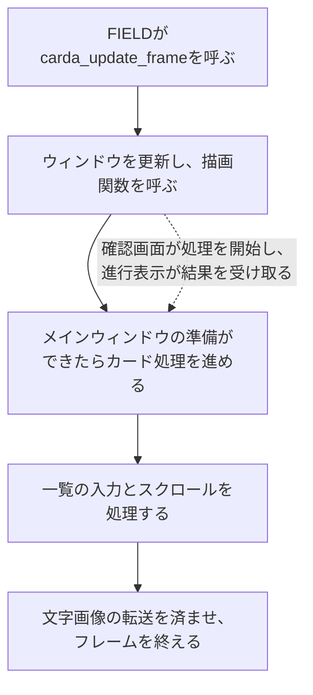
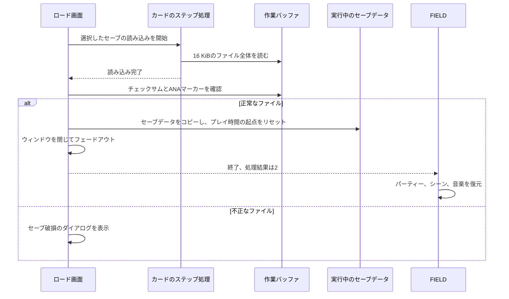
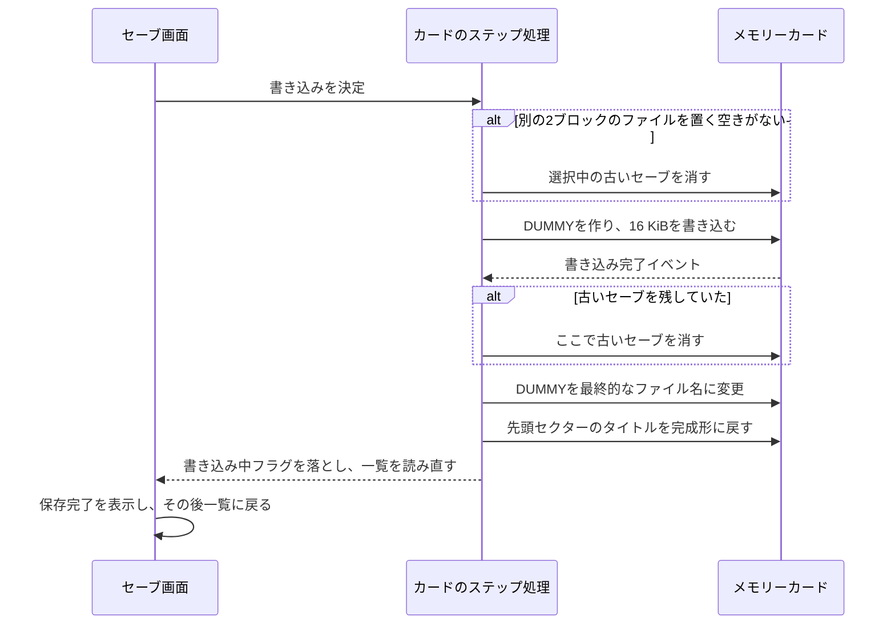

# CARDA: セーブ、ロードとPocketStationとのやり取り

[日本語ドキュメント](../../README.md) | [English](../../../en/technical/architecture/carda.md) | [セーブファイルの形式](../reference/save-file.md)

セーブファイルを選ぶころには、ゲームはすでにいくつもの処理を済ませています。
カードを確認し、ディレクトリを読み、一覧を並べ替え、選択中のファイルから詳細表示に必要な部分を読み込んでいます。
その画面と、裏で動くカード処理を担当するのがCARDAです。
ペットを「リング・りんぐ・ランド」に送り、帰ってきたペットを受け取る処理もここにあります。

モードは4つです。

| モード | 目的 | 画面 |
|---|---|---|
| 0 | 現在のゲームをセーブする | ファイル一覧、新規セーブと上書きの確認 |
| 1 | セーブしたゲームをロードする | ファイル一覧とロードの確認 |
| 2 | ペットをリング・りんぐ・ランドに送る | スロット選択、ダウンロードやペット交換の確認 |
| 3 | ペットと持ち帰ったアイテムを受け取る | スロット選択、帰還の確認、受け取ったアイテムの一覧 |

ここで押さえておきたいのは、それぞれの処理がいつ何を書き換えるかです。
プレビューを読む処理と、実行中のゲームを置き換える処理には別の段階があります。
ファイルへの書き込みが終わっても、それだけで画面が閉じるとは限りません。
その判断はカード処理とウィンドウのコールバックに分かれているので、両方をたどって説明します。
通常のセーブの中身については、[セーブファイルの形式](../reference/save-file.md)を参照してください。

## セッションを管理するのはFIELD

`field_open_carda(mode)` は、ほかのモーダル画面が開いていないときに `CARDA.BIN` を `0x80140000` へ読み込みます。
続いて `0x80170000` の作業バッファを渡して `carda_init()` を呼びます。
すでにモーダルが動いている場合は、その場で何もせず戻ります。後で開くために要求を保存する処理はありません。
FIELDは常駐したまま、現在の描画バッファを渡して毎フレーム `carda_update_frame()` を呼び続けます。

| 管理する側 | 保持するもの | CARDAでの使い方 |
|---|---|---|
| FIELD | モーダルの状態、描画バッファ、シーン、スクリプトの結果 | 現在のフレームに描画し、カード画面の終了結果を返す |
| 実行中のセーブデータ（`g_saved_game_ctx`） | 現在遊んでいるゲーム | 保存用のデータを作る、正常なロード後に置き換える、ペットやアイテムを更新する |
| CARDAの作業バッファ（`g_carda_save_blob`） | 通常のセーブ全体、またはPocketStation用の転送ファイル | 送信するデータを準備し、受信したデータを置く |
| CARDAの一覧とウィンドウ | ディレクトリエントリー、選択中ファイルのプレビュー、カーソル、確認画面 | カードの内容を表示し、次に始める処理を決める |
| カードのステップ処理（`g_card_step`） | 現在の処理、ファイルハンドル、再試行の状態 | カードに命令を出し、その結果を受け取る |

初期化ではカードイベントを開き、一覧をリセットし、UI用のVRAM領域を消去してウィンドウを作ります。
作業バッファは4バイト境界にそろえます。
テキスト、メニュー枠、フェード、効果音には、FIELD側の関数を使います。

終了の伝え方は2つに分かれています。
`carda_update_frame()` は実行中なら0、画面が終了したら1を返します。
処理の結果は `g_field_card_overlay_mode` にあり、FIELDが開始時に `mode + 1` を設定します。
ロードが完了すると2が残り、通常の一覧をキャンセルすると3になります。
ペットを送った場合は4、受け取った場合は5、それぞれのモードをキャンセルした場合は6か7です。
牧場に空きがない場合も、帰還のキャンセルと同じ結果になります。

セーブしても、CARDAはすぐには終了しません。
保存完了のメッセージを出し、カードを読み直し、メッセージを閉じると一覧に戻ります。
その後に一覧を閉じると、途中でセーブしていても終了結果はキャンセルになります。
この値が表しているのはモーダルの終わり方で、画面を開いている間に行ったすべての操作ではありません。

メインウィンドウが解放されると、CARDAは終了を要求します。
次のフレームでカードイベントを閉じ、FIELDのテキストウィンドウをリセットし、GPUの処理が終わるのを待ちます。
その後、FIELDがモーダルを終了させます。
ロードが完了していた場合は、読み込んだゲームからパーティー、シーン、音楽も復元します。

ソース：[FIELDの起動処理](../../../../src/overlays/field/ui/field_modal_stream_start.c)、
[FIELDのモーダル処理](../../../../src/overlays/field/ui/field_modal_runtime.c)、
[CARDAの入口](../../../../src/overlays/carda/carda.c)

## ウィンドウとカード処理は一緒に進む

CARDAでは、2つの状態遷移が連携しています。
片方はウィンドウを開き、描画し、閉じる処理です。
もう片方は、`g_card_step` を使ってカード操作のバイト列を順に実行します。
カードの確認、ディレクトリの読み取り、ファイルの読み書き、カード交換後のリセットなどを、このステップ列で組み立てています。



描画関数の中では、GPUパケットを作る以外のこともしています。
ロードの確認画面は読み込みを開始し、ロード中の画面は読み込んだファイルを検証して実行中のゲームへコピーします。
PocketStationのウィンドウは、転送の流れの大部分を扱います。
ソースで処理を追うときは、`carda_advance_card_sequence()` と、その操作を担当するウィンドウのコールバックを一緒に読む必要があります。

カードのステップは、続けて実行する、イベントを待つ、完了する、のいずれかを返します。
`carda_update_card_sequence()` は、結果が `CARDA_SEQUENCE_RUN_AGAIN` の間、同じフレーム内で処理を続けます。
ゲームループから進める仕組みですが、途中には `_card_wait()` やポーリングのループもあります。
すべての処理が待たずに戻るわけではありません。

BIOSのカードイベントは、ソフトウェア側とハードウェア側のそれぞれに、完了、エラー、タイムアウト、新しいカードの通知があります。
CARDAは8つすべてを `EvMdNOINTR` で開き、ポーリングします。
失敗すると、一覧の読み直し、別のステップ列への切り替え、確認画面からエラーダイアログへの切り替えなどが起きます。
書き込みの再試行カウンターは5から始まり、多くの同期ファイル操作は最大20回試します。
読み込みには別の失敗経路があるため、すべての操作が同じ回数だけ再試行されるわけではありません。

確認画面が出ている間、ディレクトリやプレビューの読み込み中、メインウィンドウを閉じている間は、一覧の入力を受け付けません。
ウィンドウの開閉中もパッド入力を消します。
現在の選択を使っている処理の途中で、カード切り替えを通常のカーソル操作として受け付けないためです。

進行バーは `VSync` の経過カウントで伸びます。
通常の読み書きでは256カウントで最大幅になり、PocketStationでは処理に応じて時間の倍率を変えます。
完了したかどうかはカードの状態で判断するので、バーの長さと転送済みの量が対応しているわけではありません。

ソース：[ウィンドウの更新、確認画面と進行表示](../../../../src/overlays/carda/carda.c)、
[カードのステップとイベント](../../../../src/overlays/carda/carda_card.c)

## セーブしたゲームをロードする

一覧を作るときは、残っている一時ファイルを消してからカードのディレクトリを読みます。
種類とファイル名の末尾で並べ替え、セーブの通し番号で新旧を判定し、認識できた中で最も新しいセーブを最初に選びます。
セーブモードでは、空きがあれば新規保存用のエントリーも一覧に追加します。
これは画面上だけのエントリーです。

カーソルを動かすと、`g_carda_selected_file` にプレビューを読み込みます。
本作のセーブなら `0x280` バイトで、カードのヘッダーとゲームの概要を表示するのに足ります。
ほかのファイルでは、タイトル用に先頭の `0x80` バイトを読みます。
どちらも、この段階では実行中のゲームを置き換えません。

ロードの確認画面を開く前に、ファイル名のプレフィックスと互換性タグを確認します。
現在のタグが `0xFF` ならどのファイルのタグでも受け付け、それ以外では選択したセーブのタグと一致する必要があります。
プレイヤーがロードを決定すると、次のように進みます。



コピーするのは `carda_draw_load_progress()` で、2つの検証を通った後です。
I/Oに失敗した場合はロード失敗のダイアログ、チェックサムかマーカーが合わない場合はセーブ破損のダイアログになります。
どちらの経路でも、読み込んだゲームを `g_saved_game_ctx` へコピーしません。

ソース：[一覧の選択処理とロード時の検証](../../../../src/overlays/carda/carda.c)、
[ディレクトリとプレビューの読み込み](../../../../src/overlays/carda/carda_card.c)

## セーブを書き込む

通常のセーブ、上書き、ロードの確認画面を開くときに、`carda_build_save_file()` が作業バッファを準備します。
実行中のプレイ時間と一覧表示用の概要を更新し、セーブデータをコピーします。
コピー側には新しいセーブIDとロード用の開始位置を設定し、タイトル、アイコン、チェックサム、`ANA` マーカーを作ります。
確認画面をキャンセルしても、実行中のカウンターや概要の更新は元に戻しません。
ただし、この時点ではカードのファイルには何も書いていません。

チェックサムは完成後のタイトルを使って計算します。
その後、タイトルの先頭を一時的な `MANA-BAD.` の文字列に置き換えます。
本体の書き込みと名前の変更が終わってから、ファイルのタイトルを完成形に戻します。

上書きでは、空き容量によって元のファイルを消すタイミングが変わります。



2ブロックの空きがあれば、新しいファイルの本体を書き終えるまで古いセーブを残せます。
空きがなければ、先に古いセーブを消す必要があります。
空きがある場合でも、削除、名前の変更、タイトルの修正は別々の操作です。
途中で失敗しても必ず元に戻せるような、ひとまとまりの置き換え処理にはなっていません。
ここでは、この順番を正確に知っておくことが大事です。

最終的なファイル名には、次の通し番号、オプションの印、画面に表示するセーブ番号が入ります。
タイトルを戻すことで、ヘッダーの内容と、すでにファイルに保存したチェックサムが一致します。
各フィールドと、途中で書き込みが止まったファイルの見え方は、[セーブファイルの形式](../reference/save-file.md)で説明しています。

未フォーマットのカードには、別の確認画面があります。
セーブとペット送信のモードではフォーマットを提案し、ロードとペット帰還のモードでは、その状態を表示します。
フォーマットを決定すると、その後にセーブや転送ファイルの作成へ進みます。
空の一覧に戻るだけの処理ではなく、書き込みの流れの一部です。

ソース：[セーブの組み立てと確認画面](../../../../src/overlays/carda/carda.c)、
[書き込み、名前の変更、タイトル修正](../../../../src/overlays/carda/carda_card.c)

## ペットを送り、受け取る

PocketStationのモードはスロット選択から始まり、`McxCardType()` で機器を確認します。
リング・りんぐ・ランドは6ブロック（`0xC000` バイト）を使います。
通常のゲームのセーブは2ブロックです。
ペットを受け取るときに読むのは、その転送ファイルの先頭 `0x400` バイトだけです。

新しくダウンロードする場合、CARDAはCDから転送用のリソースを読み込み、選択した牧場のペットと一緒に、各地域版の準備関数へ渡します。
カードへの書き込みが完了すると、実行中の牧場レコードの名前を空にして、その枠を空きにします。
結果は4になります。

リング・りんぐ・ランドにすでにペットがいる場合は、交換になります。
CARDAは先にそのペットを読み、同じ固有IDのペットが牧場にいる場合は処理を断ります。
交換を決定すると、受け取るペットのコピーを保持してアイテムを加え、それから送るペットのデータを準備して書き込みます。
書き込みが完了した後、送り出したペットの牧場の枠へ、受け取ったペットを戻して成長を反映します。
アイテムが増えるのは送信前で、牧場のペットが入れ替わるのは書き込み完了後です。

別のペットを送らずに帰還させる場合は、次の順番です。

1. リング・りんぐ・ランドを消すことを確認し、転送ファイルの先頭を読む。
2. 同じ固有IDのペットが牧場にいないことを確認し、空き枠を探す。空きがなければ結果7で終了する。
3. 受け取ったアイテムを加え、その枠にペットを復元する。経験値の増分を加え、FIELDのレベルアップ処理を呼ぶ。
4. リング・りんぐ・ランドのファイルの削除を要求し、FIELDへ返す結果を準備する。この削除を呼ぶ時点では、実行中のペットとアイテムは更新済み。
5. 実際に増えたアイテムの一覧を表示する。増えたものがなければ、そのまま終了する。正常な帰還の結果は5。

すでに99個持っているアイテムは加えません。
受け取り一覧に出るのは、実際に加えたものです。プレイヤーが一覧を閉じるまで反映を待っているわけではありません。
ここで変わるのは実行中のゲームです。
この転送処理が、通常の2ブロックのゲームセーブまで書き込むことはありません。

ソース：[転送の流れとアイテム処理](../../../../src/overlays/carda/carda.c)、
[転送ファイルのI/O](../../../../src/overlays/carda/carda_card.c)

## データの中身を見る

コードの後ろにあるデータは、各地域版のsplat YAMLで1つの `carda_data` にまとめています。
ビルドでは、そのバイト列をそのままリンクします。
テキストを読んだりアイコンを見たりするには、対象の地域版を `make splat` で展開してから、次を実行します。

```sh
make extract-carda
make extract-carda VERSION=jp
```

出力先は `assets/exports/<version>/overlays/carda/` です。
メッセージ、アイテム名、場所の名前、タイトルのひな形、カード処理の手順はYAMLになります。
パーティーのアイコンは48 x 48のPNGです。
メモリーカード用の10種類のアイコンは `save_icons/` に入り、各アイコンのアニメーション2コマを16 x 16のPNGとして書き出します。
日本語のテキストはオーバーレイ内の文字変換表で復号し、元のバイト列も隣に残します。

`byte-map.yaml` には、パディングやゼロで埋められた実行時バッファも含め、データ全体の内訳が載ります。
出力は中身を確認するためのもので、ビルドが使うのは元のデータです。
出力先の指定やPython側の構成は、[抽出ツールの説明](../../../../tools/data/overlays/README.md)を参照してください。

## 地域版の違いと、まだ調べること

共通のCコードから、両地域版の通常のカードI/Oと転送処理を読めます。
上で説明したペットのコピー、アイテムの加算、ファイル削除の順序は、日本版の転送ウィンドウ（`carda_draw_save_flow`）でも同じです。

転送用リソースを準備するのは `card_prepare_pet_transfer` です。
日本版では、ペットのレコードをコピーし、報酬の一覧を空にし、配置済みのランドとマナを最大まで育てたランドを記録します。
北米版では、この関数は何もしません。
そのため、北米版に転送の分岐が残っていることだけでは、北米版でリング・りんぐ・ランドが動く根拠にはなりません。
PocketStation用のメッセージも空のままです。

共通の「はい／いいえ」の初期化関数は、北米版では「いいえ」、日本版では「はい」を選びます。
転送画面の中には選択を直接設定するものもあるため、すべての確認画面に当てはまる規則ではありません。
日本版では、文字の行間や一覧の配置も異なります。

残っている調査の中心は転送データの中身です。
日本版の準備関数が設定する追加データの意味や、ミニゲーム側がそれをどう使うかは、さらに追う必要があります。
このページで扱うのは、CARDA側のやり取りです。
通常のセーブのタグやオプションで未解明のものは、[セーブファイルの形式](../reference/save-file.md)にまとめています。

ソース：[地域別の準備フック](../../../../src/main/card_callbacks.c)、
[CARDAの地域別分岐、転送ウィンドウ、確認画面の初期選択](../../../../src/overlays/carda/carda.c)

UIの型や状態の名前は、[carda_internal.h](../../../../src/overlays/carda/internal/carda_internal.h)から追えます。
[carda_glyph.c](../../../../src/overlays/carda/carda_glyph.c) は、カードのタイトルに使う共通の文字キャッシュ処理を組み込んでいます。
文字コードについては、[テキストテーブル](../reference/text-tables.md)を参照してください。
[ADDHERO](addhero.md) にも似た一覧画面がありますが、こちらはゲストの主人公を読み込んで書き戻す処理で、セーブのどの部分を書き換えるかが異なります。
