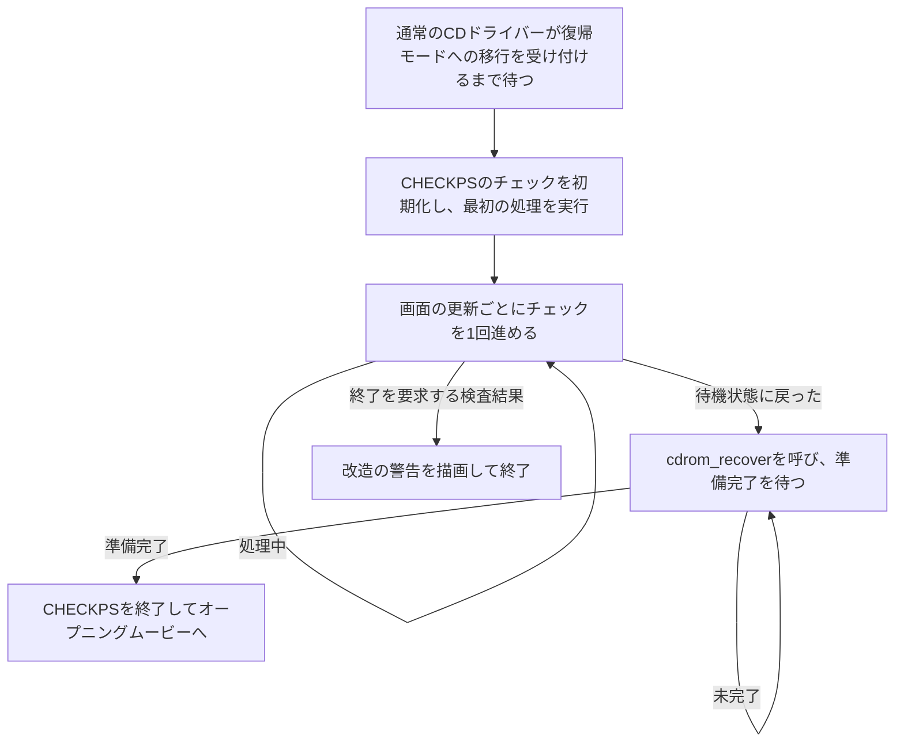

# CHECKPS: 起動画面とCDのチェック

[日本語ドキュメント](../../README.md) | [English](../../../en/technical/architecture/checkps.md) | [CD-ROMの仕組み（英語）](../../../en/technical/architecture/cdrom.md)

CHECKPSは、オープニングムービーの前に動きます。
北米版では画像を数秒表示して戻ります。
日本版はその間にCDコントローラーをチェックし、通常のCDドライバーを復帰させてから画面を終了します。

Cコードだけを読むと、この違いを見落としやすいです。
両方のオーバーレイにチェック用の関数がありますが、日本版の起動処理はまだアセンブリから組み込んでいます。
北米版の起動ループからは、そのチェック関数を呼びません。
ここでは両方の流れを追い、ハードウェアの改造を知らせる警告に進んだときの動作も説明します。

## CHECKPSが始まるまで

メイン実行ファイルは、通常のCDリソース読み込みを使って `CHECKPS.BIN` を読み込み、`0x80100000` の描画用作業領域を `run_checkps()` に渡します。
CHECKPSのロード先は、北米版では `0x8004FC70`、日本版では `0x8004FDD8` です。
後でFIELDが使う大きなオーバーレイ領域に入るため、この画面の裏でFIELDが動いているわけではありません。

戻り値の扱いは、地域版によって異なります。

| 地域版 | 開始 | 終了後 |
|---|---|---|
| 北米版 | メインのゲーム状態ループに入る前に、CHECKPSを1回呼ぶ | すでに `GAME_STATE_INTRO_MOVIE` を選んでいるので、関数の戻り値は使わない |
| 日本版 | ゲーム状態6から始まり、そこでCHECKPSを読み込んで実行する | 戻り値の8を次のゲーム状態に設定し、オープニングムービーへ進む |

`run_checkps()` は内蔵の音声バンクと画面を準備し、自分の描画ループを動かします。
ループが終わると `GAME_STATE_INTRO_MOVIE` を返します。
CARDAのように、1フレームごとに呼び出し側へ戻る作りではありません。

ソース：[共通のメインループ](../../../../src/main/main.c)、
[共通のCHECKPS起動処理](../../../../src/overlays/checkps/init.c)、
[ゲーム状態の名前](../../../../include/main/game_state.h)
日本版を追うときの位置は、このページの最後にまとめています。

## 北米版の画面は時間で終わる

画面の初期化ではVRAMを消去し、2組の表示・描画環境を作り、文字キャッシュをリセットします。
黒から通常の明るさへ、20回の更新でフェードします。
内蔵画像のパレットとピクセルを転送し、表示カウンターを120に設定します。

各ループでは、フェードと画像のパケットを作り、入力とカウンターを更新します。
描画完了と `VSync(2)` を待ってからバッファを切り替えます。
通常のCD処理も、`cdrom_process_state()` で進めます。
60 Hzで、1回の更新に2表示周期かかるとすると、120回はおよそ4秒です。
途中の処理が待たされれば、その分だけ長くなります。

カウンターが0になると `g_checkps_exit_reason` が2になり、ループが終わります。
入力の取得と押下・リピート判定はありますが、この経路にはボタンで画面を飛ばす判定がありません。
ここでの終了条件はカウンターです。

音声の初期化では、必要に応じて内蔵のAKAOバンクを登録し、サンプルを転送します。
同じ単位に曲の読み込みや再生の関数もありますが、北米版の起動経路からそれらを呼んでいるわけではありません。

ソース：[init.c](../../../../src/overlays/checkps/init.c) の
`run_checkps_display_loop()`、`init_checkps_display()`、
`update_checkps_input_and_timeout()`

## 日本版はドライブを借りて、返す

日本版で `update_checkps_input_and_timeout()` と呼んでいる関数は、別の仕事をしています。
4段階の起動処理を進める関数です。
名前は北米版に由来していて、日本版のこの関数には120回のカウントダウンはありません。



引き継ぎには `cdrom_enter_recovery_mode()` を使います。
新しい要求を受け付けるのは、通常のコマンド処理が待機中で、キューが空で、復旧エラーが残っていないときです。
受け付けると `CD_STATUS_RECOVERY_PENDING` が立ち、通常の処理から新しい仕事を出さなくなります。
その間、CHECKPSが自分のコードでコントローラーのレジスターを操作します。

日本版は `start_cd_integrity_check()` の後に `run_cd_integrity_check(1)` を呼びます。
以降の画面更新でも後者を呼び続け、0が返るのを待ちます。
続いて `cdrom_recover()` を呼び、0以外が返ったら `g_checkps_exit_reason` を2にして画面を終了します。
チェックが終わっただけでは、まだ終了できません。
通常のドライバーが使う動作モードを戻すところまでが、CHECKPSの処理です。

その間も、日本版の描画ループは動いています。
画像を描く関数はテクスチャ付きの四角形をアニメーションさせ、効果音も鳴らします。
北米版の中央に画像を1枚置く実装とは異なり、この描画コードもまだアセンブリです。
チェックはアニメーションの進行とは独立して動きます。

通常のドライバーの復帰手順は、[CD-ROMの解説（英語）](../../../en/technical/architecture/cdrom.md#explicit-reconfiguration-is-a-separate-protocol)にあります。
CHECKPSからの呼び出しは、日本版のアセンブリで確認できます。
`0x800506B8` の `update_checkps_input_and_timeout()` が担当し、起動処理の段階を `D_80067E10` に保持しています。

ソース：[通常のCDドライバー](../../../../src/main/cdrom.c)、
[日本版CHECKPSのシンボル表](../../../../config/jp/symbols/checkps_symbol_addrs.txt)、
[地域別のCHECKPS起動処理](../../../../src/overlays/checkps/init.c)

## CDのチェックで行うこと

CHECKPSの [cdrom.c](../../../../src/overlays/checkps/cdrom.c) には、独立したコマンド送信と応答のポーリング処理があります。
ゲームのリソースキューには要求を入れず、CDコントローラーのレジスターを直接操作します。
コマンド表には、命令コード、引数の数、応答の長さ、割り込みコードの合計値の期待値が入っています。
ポーリング側は応答を読み、処理待ち、完了、ディスクエラー、蓋が開いている状態を区別します。

`start_cd_integrity_check()` が最初の状態を選びます。
`run_cd_integrity_check(1)` は状態処理を1回実行して戻ります。
その1回では、まだ応答を待っていることもあります。
引数を0にすると、チェックが待機状態に戻るまで繰り返します。
日本版は1回ずつ実行する形を使い、画面の更新を続けられるようにしています。

主な経路は、次のようになっています。

| 段階 | コマンドと目的 |
|---|---|
| 位置を決める | `GetTN`、`Init`、`GetTD` でトラックの情報を取得し、シーク先を準備する |
| 識別情報を確認する | `ReadTOC` と `GetID`。`ReadTOC` が特定の不正コマンド応答を返した場合は、直接 `Setloc` へ進む代替経路を使う |
| テストを始める | `Setloc`、`Setmode`、待ち時間を挟んで `SeekP`、`Mute`、`Play` |
| テスト結果を読む | `Test(0x04)`、待ち時間、`Test(0x05)` |
| 終える | テスト結果を受け入れた場合、少し待って `Pause` を発行し、待機状態へ戻る |

待ち時間のしきい値は、シーク前が3、テスト間が200、ポーズ前が10の `VSync` 周期です。
比較はしきい値を超えるまで待つ形で、呼び出し側の更新間隔によって、実際に次へ進む時点も変わります。
チェック全体のタイムアウトを表しているわけではありません。

強制終了の警告に進む経路は2つあります。
`GetID` のディスクエラーは直接警告へ進みます。
`Test(0x05)` の後は、`g_cd_response_payload[0]` が0以外なら `Nop` で確認し、その完了後に警告へ進みます。
0なら、ポーズして終了する経路です。

それ以外のエラーでは、処理を最初からやり直す場合が多くあります。
蓋が開いているときは `Nop` のポーリングへ移り、ドライブが完了を返したら再開します。
状態処理全体に再試行回数の上限はないため、ドライブの問題が解消しなければ、日本版の起動画面に留まり続けることがあります。
戻り値は単純な合格・不合格ではなく、状態や処理結果のコードです。
呼び出し側が待っているのは、待機状態を示す0です。

ここまでが、プログラムから確認できる判定です。
コントローラーの各リビジョンや改造された本体で、それぞれの応答が何を意味するかまでは確認できていません。
警告の文面だけから、どの経路でも同じハードウェアの状態を検出しているとは言えません。

## 警告画面は通常の処理を止めて描く

強制終了の経路ではGPUをリセットし、コールバックを止め、SPUの制御レジスターに0を書きます。
新しい表示環境を作って警告と模様を描き、画面表示を有効にしてから、BIOSラッパーの `exit()` を呼びます。
通常の起動画面に戻ったり、再試行を選ばせたりする処理はありません。

内蔵のメッセージは、どちらの地域版でも日本語です。

```text
強制終了しました。
本体が改造されている
おそれがあります。
```

文字にはBIOSの漢字ROMを使います。
3行を描いた後、1ピクセルずらした2回目の描画で影を付けます。
周囲の赤い四角形は `pattern.c` が描きます。

この経路は、GPUへ直接送る命令と専用の漢字描画コードを使います。
通常のフレームやコールバックの設定を捨てた後でも、警告を組み立てられる作りです。
`font.c` の文字キャッシュは通常の表示処理用で、この終了時の警告を描く経路ではありません。

ソース：[警告と終了処理](../../../../src/overlays/checkps/cdrom.c)、
[漢字描画](../../../../src/overlays/checkps/kanji.c)、
[診断用の模様](../../../../src/overlays/checkps/pattern.c)、
[BIOSの終了ラッパー](../../../../src/psyq/libc2/exit.c)

## 埋め込みリソースを見る

各地域版のsplat YAMLでは、初期値を持つデータを1つの `checkps_data` にまとめています。
警告文と四象限の符号はコードの前にある小さな `rodatabin` に入り、実行時のバッファはBSSに残しています。
中身を見るには、対象の地域版を `make splat` で展開してから、次を実行します。

```sh
make extract-checkps
make extract-checkps VERSION=jp
```

出力先は `assets/exports/<version>/overlays/checkps/` です。
元のTIMとパレットごとのPNG、復号した警告文に加え、CDコマンド、レジスタのポインタ、初期状態、模様のテーブル、数字の文字コードをYAMLに書き出します。
北米版は256 x 48の画像と1つのパレット、日本版は256 x 256のテクスチャと16個のパレットを持っています。
日本版のPNGは保存されたテクスチャ全体で、アニメーションがその一部を選んで動かす前の状態です。

AKAOのコンテナとバンクのヘッダも復号し、32個のアーティキュレーションの設定を一覧にします。
プログラムとADPCMサンプルは元のバイナリとして保存します。このツールで音を再生・合成するわけではありません。
`byte-map.yaml` は2つの入力ファイル全体を対象にし、パディングや用途がまだ分からない末尾のバイトも記録します。
ビルドがリンクするのは、引き続き元のバイト列です。

ファイル構成や出力先の指定は、[抽出ツールの説明](../../../../tools/data/overlays/README.md)を参照してください。

## 地域別のソースを追う

どちらのバージョンでも、CHECKPSとメインループは共通のCコードからビルドされます。
地域ごとの起動処理は、`src/overlays/checkps/init.c` と `src/main/main.c` の
`VERSION_JP` 分岐を追ってください。

`make splat VERSION=jp` の後に見るファイルは、`asm/jp/main.s` と `asm/jp/overlays/checkps/init.s` です。
次の位置から追うと、流れがつかみやすいです。

| 日本版の位置 | 追う内容 |
|---|---|
| メインループの `0x800111B0` のブロック | 状態6でCHECKPSを読み込み、戻り値を次のゲーム状態に設定する |
| `0x80050030` の `init_checkps_display` | 表示用リソースを初期化し、CDの復帰モードを要求する |
| `0x800506B8` の `update_checkps_input_and_timeout` | ドライブを引き継ぎ、チェックし、通常のドライバーを復帰させる |
| `0x80050788` の `draw_checkps_image` | 日本版のアニメーションを更新し、GPUパケットを作る |
| `0x80050C2C` の `load_checkps_image` | アニメーションのレコードを初期化し、起動処理の段階を0に戻す |

上で説明した呼び出しと引き継ぎは、このアセンブリで確認しています。
北米版がチェック用のコードを残しながら、この起動経路では呼ばない理由は、まだわかっていません。
日本版のアニメーション状態の詳しい名前や、コントローラーのテストが物理的に何を調べているかも、今後の調査が必要です。
ただし、CHECKPSがいつ始まり、何を待ち、どこで画面やゲームを終了するかは、ここまでの流れで追えます。
