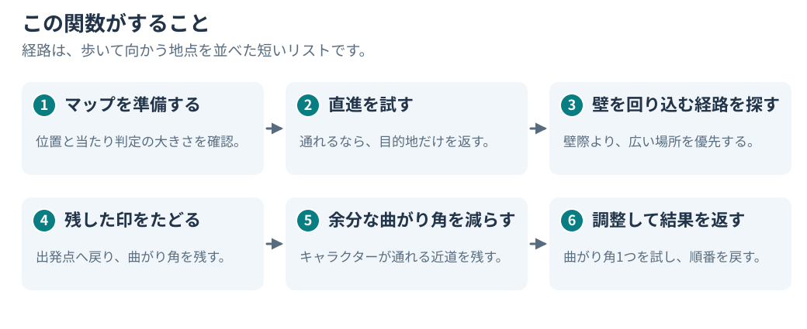
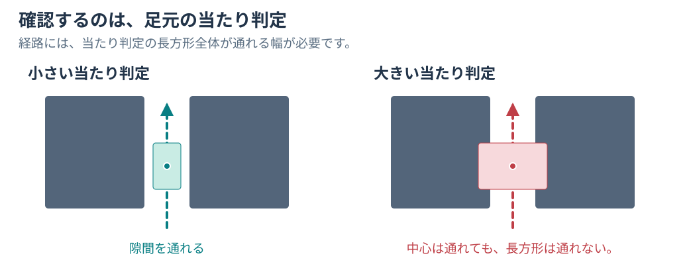
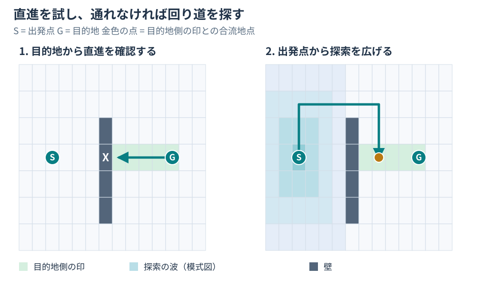
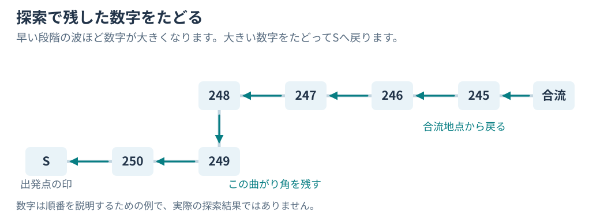
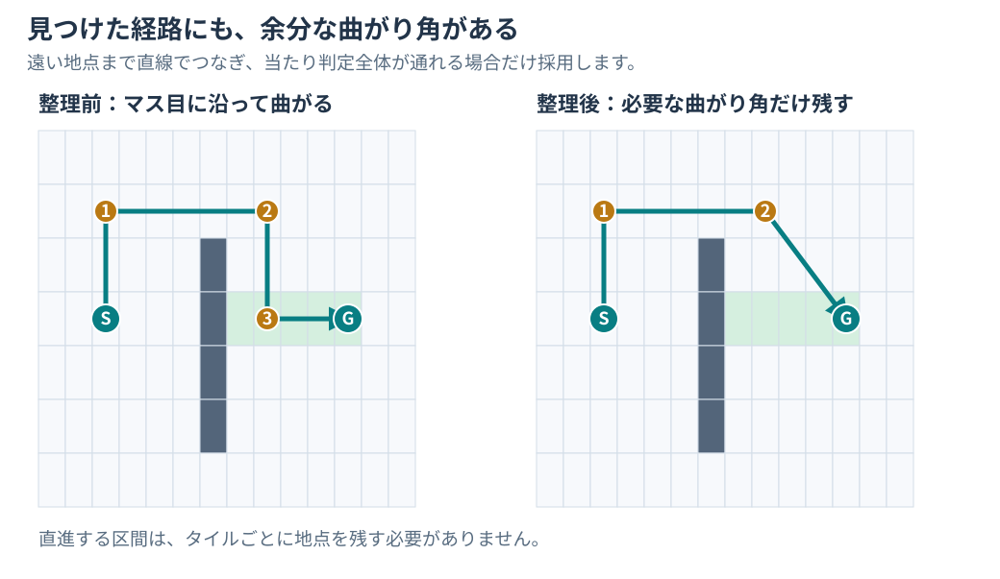
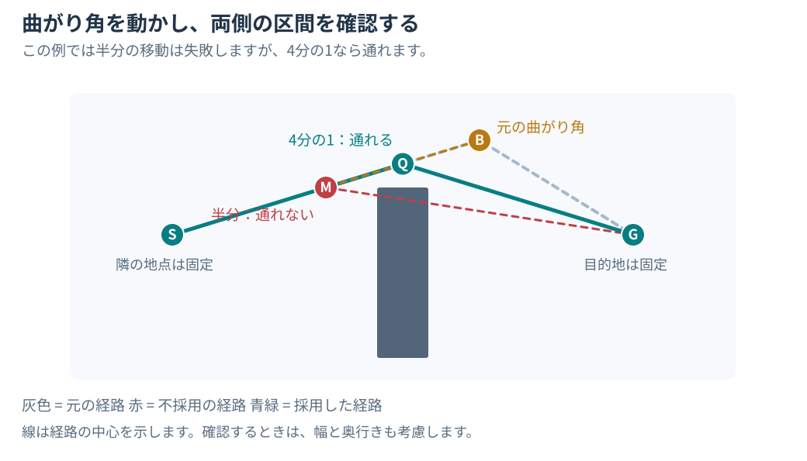

# フィールドの経路探索の仕組み

[日本語ドキュメント](../../README.md) | [English](../../../en/technical/reference/field-pathfinding.md) | [当たり判定のソース](../../../../src/overlays/field/field_collision.c)

壁の片側にキャラクターがいて、反対側に目的地があります。
角に引っかからず、壁を回り込んで歩いてほしい。
それだけなら簡単そうですが、目的地を決めてから、キャラクターが実際に使える経路になるまでには、いくつかの処理が必要です。

その処理をするのが `field_collision_find_path` です。
出発位置、目的地、キャラクターの当たり判定の大きさを受け取り、歩いて向かう地点のリストを返します。
キャラクターを移動させたり、アニメーションを再生したりするコードは、その後でこのリストを使います。

ここでは、壁を回り込む経路を1つ追ってみましょう。
ポインターの計算やキューの管理はいったん置いておいて、それぞれの処理が何をしようとしているのかを見ていきます。

図は説明用に簡略化した例です。ゲームの画面や、実際の探索結果を記録したものではありません。
`S` が出発点、`G` が目的地で、濃い色のブロックが壁です。
マス目の図は地面を真上から見たもので、ゲームの当たり判定用タイルは、幅に対して奥行きが2倍あります。

## まず、キャラクターが通れる大きさか確認する

キャラクターが地面で占める長方形の範囲を、ここでは「足元の当たり判定」と呼びます。
目的地が1つの点でも、そこまで移動するキャラクターには幅と奥行きがあります。
隙間に線を引けるからといって、その線に沿ってキャラクターも通れるとは限りません。

この関数は、経路全体で出発点のクエリにある幅と奥行きを使います。
目的地のクエリから使うのは位置だけで、そちらの幅と奥行きは使いません。
同じキャラクターをある場所から別の場所へ動かすので、途中で大きさを変える必要はないわけです。

この関数を呼ぶ前に、アクター側のコードが、その当たり判定に合わせて衝突マップを準備します。
通れない場所や、壁の近くのタイルに印を付けます。
探索はこの準備済みのタイルを使い、直進の確認では、線に沿って動く長方形全体が通れるかを調べます。

関数は位置をマス目の座標に変換し、それぞれの位置の高さから、使う当たり判定の床も選びます。
ここでいう床は、ある高さに対応する当たり判定用タイルのグループです。画面に見える床の絵そのものではありません。
指定された高さ以下の床のうち、最も高いものを選びます。位置がすべての床より低ければ、一番下の床を使います。
この処理で階段を作ったり、床同士をつなぐ経路を用意したりするわけではありません。

内部では、位置は当たり判定の長方形の角を指します。
最後に地点を書き出すときに、キャラクターの中心を指す座標に戻します。
経路の説明では、その2つを毎回切り替えて考える必要はありません。図は見やすいように小さい印で地点を示しています。

## 探索する前に、まっすぐ歩けるか試す

目的地までまっすぐ歩けるなら、必要な地点は目的地の1つだけです。
マップのほかの場所を探索したり、余分な曲がり角を作ったりする必要はありません。

直進の確認は、**目的地から出発点に向かって**行います。
その線に沿って当たり判定の長方形を動かし、重なるタイルを調べます。
確認したタイルには、目的地を表す印を付けていきます。

今回の例では、壁にぶつかって確認が止まります。
ただ、目的地側で確認したタイルには、すでに印が付いています。
後の探索は、この印を目指せます。`G` がある1つのタイルまで到達しなくても、印の付いた帯状の領域に合流すればよいわけです。

ソースを読んでいると、この点は見落としやすいと思います。
直進できるかどうかの確認が、その後に続く探索の準備にもなっています。

すぐに結果を返す場合は、ほかにも2つあります。
出発点と目的地が同じタイルにある場合は、目的地を返します。
当たり判定の床グループがないシーンでも、目的地1つだけを返します。
後者は床のマップがない場合の代替処理で、障害物を避ける探索に成功したという意味ではありません。

## 出発点から探索を広げる

直進できなかったので、今度は `S` から探索を始めます。
通れる床に波が広がっていく様子を考えると、わかりやすいと思います。
それぞれの波が、これまでに到達したタイルの周囲を調べます。次に見つかったタイルは、後の波で処理します。

進める方向は8つです。マス目に沿った上下左右の4方向と、斜めの4方向があります。
斜めに進むときは、角を通れるかも確認します。
両側のタイルが通れる状態で、壁付近かどうかの扱いもそろっている必要があります。
斜め先のタイルが空いていても、ふさがった角の間をすり抜けることはできません。

壁の近くと印を付けられたタイルは、探索を広げるまで長めに待たされます。
その分、広い場所を通る経路が先に進めます。
キャラクターを動かすなら、障害物ぎりぎりをなぞるより、角の周りに少し余裕があるほうが使いやすいですよね。

ソースにある4つのキューは、順番に切り替えながら、この波と待機中のタイルを管理しています。
4本の別々の経路を探しているわけではありません。
関数の長い中盤は、周囲のタイルを調べる同じような処理を、方向ごとに繰り返している部分が多くあります。

波が目的地側の印に合流すると、その波の処理を終えてから探索を止めます。
図の金色の点が、この合流地点です。
本当の目的地まではまだ距離があるので、これで全部終わりではありません。

この探索は広い場所を優先しますが、必ず最短の経路を返すとは言えません。
探索を続けられる範囲や、保持できる項目の数にも上限があります。

## 残した印をたどって戻る

探索は、訪れたタイルに数字を書き込みます。
波が外へ広がるほど、その数字は小さくなります。
先に到達したタイルほど大きい数字になるのが基本なので、それを出発点へ戻るための目印にできます。

まず、正確な目的地の位置から、合流したタイルまでつなげるか試します。
直接つなげなければ、最初の目的地から出発点への線をもう一度調べます。今度は合流したタイルに到達したところで止めます。
この確認でも、経路を組み立てるための印を残します。
どちらでもつなげない場合は、目的地のタイルから経路をたどり始め、出発点へ戻れる印を探すことになります。

戻るときは、周囲の移動可能なタイルから、現在より大きい数字を持つものを選びます。
候補が複数あれば、一番大きい数字を選びます。
これを出発点の印まで繰り返します。途中で次の目印が見つからなくなれば、エラーになります。

このとき、通ったタイルをすべて経路の地点として残す必要はありません。
進む方向が変わらなければ、そのまま歩き続ければよいからです。
関数は方向が変わる場所を記録し、細かい1歩ずつではなく、曲がり角を残します。

この段階で保存されている経路は、**目的地から出発点へ戻る順番**です。
後半のコードが逆向きに処理しているように見えるのは、そのためです。

## いらない曲がり角を減らす

マス目に沿って進めば経路は見つかります。
ただ、地点同士をまっすぐつないでよいなら、もう必要のない曲がり角が残ることがあります。

関数は、保存した経路の目的地側から処理します。
各地点から、残っている一番遠い地点まで直線でつなげるかを先に試します。
通れなければ、より近い地点を試します。
つなげられたら、その間にある曲がり角を飛ばします。

図の最初の経路は、上へ進み、横へ進み、下へ進んでから、また横へ進みます。
整理した経路でも、壁を回り込むために、上側の2つの曲がり角は必要です。
ただ、2つ目の曲がり角から目的地へはまっすぐ歩けます。
最後の余分な曲がり角を残す意味がなくなっています。

どの近道も、同じ当たり判定の確認を通します。
線が壁に重ならないだけでは足りません。その線に沿ってキャラクター全体が通れる必要があります。
この段階の確認では、探索で残した数字を上書きせずに、通れるかどうかだけを調べます。

## 目的地に近い曲がり角を少し調整する

不要な曲がり角を減らした後、**目的地に一番近い曲がり角**を動かす場合があります。
これは、探索が正確な目的地のタイル以外で、目的地側の印に合流したときに行う限定的な調整です。
すべての曲がり角を調整したり、経路全体を曲線にしたりする処理ではありません。

使うのは、目的地側の地点、曲がり角、出発点側の地点という、隣り合った3つの地点です。
両隣の地点は固定し、曲がり角だけを動かします。

まず、曲がり角を出発点側の隣の地点へ向かって、距離の半分だけ動かしてみます。
**新しくできる2つの区間が、両方とも当たり判定の確認を通る必要があります。**
片方がよくなっても、もう片方が壁を通るようになるなら、その移動は採用しません。

半分の移動で通れたら、同じ方向へ、残りの距離の半分をもう一度動かしてみます。
最初の移動で通れなければ、代わりに元の距離の4分の1だけ動かしてみます。
図では、この小さい移動が役立つ理由がわかります。
半分まで動かすと壁を横切りますが、4分の1なら通れる経路を保てます。

次に、目的地側の隣の地点に向かって、同じ試し方を繰り返します。
すでに採用した調整があれば、その位置から続けます。
両側の区間を通れる調整が見つかった場合だけ、最後に曲がり角の位置を書き戻します。
見つからなければ、元の位置を残します。

## 移動のコードに経路を返す

地点は逆向きに保存されているので、結果を書き出すときに順番を反転します。
呼び出し側が受け取るのは、出発点に近い次の地点から、経路の先へ進む順番です。
現在の出発位置を、追加の通過点として返すことはありません。キャラクターはすでにそこにいます。

返せる地点は最大16個です。
それより多い場合は、出発点に近い側の地点を残します。
そのため、上限まで使った結果には、目的地が含まれないこともあります。
通常の直進できる経路なら、目的地だけを返します。

返す地点に入っているのは、地面上の位置を表す `x` と `z` です。
アニメーション、歩く速さ、高さ方向の移動計画は含みません。
受け取った後の移動は、アクター側のコードが処理します。

処理に失敗した場合は、負の値を返します。

| 結果 | 起きたこと |
| --- | --- |
| `-1` | シーンに床グループはあるが、作業用の衝突マップがない。 |
| `-2` | 出発点か目的地が、探索に使えるマス目の範囲外にある。 |
| `-3` | 探索できる波の上限に達したか、これ以上調べるタイルがなくなった。 |
| `-4` | 探索のキューか、一時的な経路の保存領域が足りなくなった。 |
| `-5` | 出発点へ戻る途中で、次の目印を見つけられなかった。 |

探索に失敗しても、それだけでアクターの次の動きが決まるわけではありません。
[移動のコード](../../../../src/overlays/field/field_actor_script_ops.c)にある2か所のアクタースクリプトからの呼び出しでは、
この関数が失敗すると、目的地1つだけの経路に切り替えます。
そのため、キャラクターがまだ動こうとしているからといって、経路探索に成功したとは限りません。

## ソースのどこを見ればよいか

経路の流れがわかると、この長い関数も少し読みやすくなります。
[`field_collision_find_path`](../../../../src/overlays/field/field_collision.c)では、次の部分が目印になります。

| 追っている処理 | 見る場所 |
| --- | --- |
| 位置と床を準備する | 冒頭の確認と、`start_group` / `goal_group` の選択。 |
| 直進を試す | 最初の `field_collision_trace_line(&trace)` 呼び出し。 |
| 探索を広げる | `while (1)` のループと、その中で繰り返される周囲のタイルの処理。 |
| 目的地をつなぎ、印をたどって戻る | 波のループの後の処理と、`previous_direction` を使う逆向きのループ。 |
| 曲がり角を減らす | "Keep the farthest visible point" というコメントのある部分。 |
| 目的地側の曲がり角を調整する | "Smooth the bend nearest the goal" というコメントのある部分。 |
| 地点を返す | 最後に、逆順で結果を書き出すループ。 |

この関数のすぐ下にある `field_collision_trace_line` は、共通の直進確認です。
最初の直進、目的地への接続、近道、曲がり角の調整は、すべてこの関数を使います。
この1つの処理を押さえておくと、同じ呼び出しが何度も出てくる理由がわかりやすくなります。
